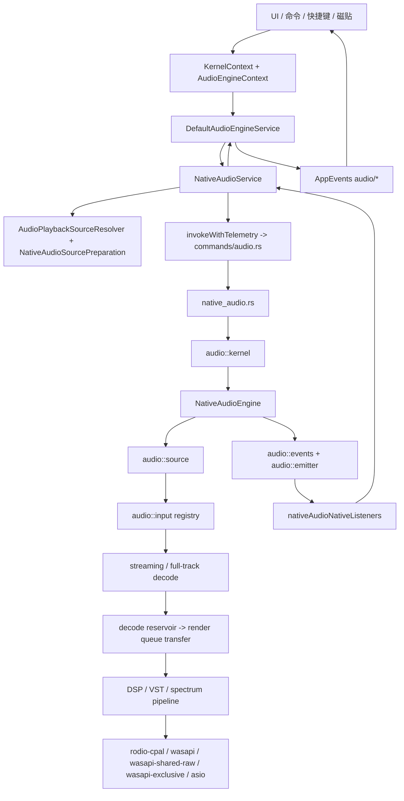

# Pixel Matrix Player 音频链路现状

Last reviewed: 2026-05-04

本文档基于当前源码和旧音频文档中仍有价值的 guardrail 整理。遇到冲突时以当前源码为准，旧文档只作为已吸收的历史背景。

## 事实源

已吸收的历史资料：

- 旧 `documents/audio/` 音频链路、稳定性计划、生产边界与 code review 文档
- 旧根目录 `audio-engine-robustness-guardrails.md`

主要代码入口：

- 前端 service：`apps/desktop/src/services/audio/`
- Tauri command：`apps/desktop/src-tauri/src/commands/audio.rs`
- Rust facade：`apps/desktop/src-tauri/src/native_audio.rs`
- Rust audio engine：`apps/desktop/src-tauri/src/audio/`
- VST/JUCE bridge：`apps/desktop/src-tauri/src/vst_dsp.rs`、`apps/desktop/src-tauri/sidecars/pmp-vst-bridge-juce/src/main.cpp`

## 生产热路径

当前生产播放边界应保持为：

```text
source identity
-> transport materializer
-> input adapter
-> decode
-> transfer
-> render queue
-> output backend
```

这条边界来自 `audio-engine-production-boundary.md` 与 `audio-engine-robustness-guardrails.md`，当前源码大体遵守该方向：

- `source identity` 保持曲目身份，不应被远端 sparse cache 状态污染。
- `transport materializer` 负责远端下载、完整缓存、取消、single-flight 与 full-track fallback。
- `input adapter` 决定本地文件、完整缓存、远端 growing cache 或 full-track materialization。
- `decode -> transfer -> render queue -> output backend` 仍是播放稳定性的核心路径。
- `AudioStabilityController`、external hint、memory pressure、page-lock 失败、memory-pool growth 等现在主要是可观测信号，不应默认直接改写生产热路径。

当前源码里仍有一处要特别注意：`buffer_policy.rs` 中 `decode_push_backoff(...)`、`output_producer_backoff(...)` 在 `Guarded` / `Critical` 下仍返回 `Duration::ZERO`，`adaptive_transfer_strategy(...)` 在 `adaptation_level > 0` 时也会把 `producer_backoff` 设为 `Duration::ZERO`。这与部分旧文档里“已补 bounded wake 地板”的描述不一致，应按源码视为仍存在的调度风险。

历史稳定锚点可作为排查参考：

- 可接受 recovery baseline：`cf0e648`，提交说明为 `audio: stream remote sources from growing cache backing`。
- 历史 diff 稳定锚点：`0e84336`，2026-04-20 tree snapshot。
- `321cdbd` 到 `6af45bb` 一带引入过 controller / pressure feedback loop，旧文档记录其曾 destabilize production playback。
- `66982d2` 和 `9994d33` 一带的 remote range work 曾走向 canonical playback cache sparse mutation，并导致 remote seek/resume 后噪声风险。

## 总览图



## 前端链路

### 暴露层

`KernelContext.tsx` 注册 audio module，最终把 `IAudioService` 暴露给 React 和宿主 UI。`AudioEngineContext` / `DefaultAudioEngineService` 是多数 UI 使用的 facade，负责把播放状态、队列、时间、错误、事件回调收口到统一接口。

上层消费包括：

- 播放控件、页面、磁贴
- 快捷键和命令系统的播放状态上下文
- media session / taskbar / 桌面歌词等状态消费者
- native debug、robustness、spectrum、输出后端设置等调试和设置 UI

### `NativeAudioService`

`NativeAudioService.ts` 是前端音频编排核心。它不是单纯的 Tauri command wrapper，而是同时承担：

- 本地 `AudioState` 镜像和订阅通知
- queue / currentIndex / currentTrack 与 Rust payload 的双向重建
- 播放偏好、音量、静音、play mode 的持久化和跨窗口同步
- source prepare、平台播放、云端 fallback、native source load
- seek coalescing、乐观 currentTime、dynamic SRC hold
- output backend、DSP/VST、spectrum、高级调优、robustness state
- working set trim 的延迟调度与 protection window

这也意味着它是当前前端复杂度汇聚点。后续新增 audio 行为时，优先判断是否可以下沉到 resolver、transport facade、robustness adapter 或独立 service，而不是继续扩大 `NativeAudioService`。

### Source prepare

`AudioPlaybackSourceResolver` 把曲目归一成几类 prepared source：

- `local-file`
- `cache-file`
- `remote-stream`
- `deferred`

`NativeAudioSourcePreparation` 负责把 prepared source 转为 native command payload。远端 source 通过 `streamUrl`、`sourceLocator`、`connectorId`、headers、过期时间、`seekable`、`rangeRequests` 等字段下沉到 Rust。

当前兼容路径仍保留 `applyMaterializedPath(...)`：如果 native 返回 materialized cache path，前端会把它应用回 track / queue。对于 locator-native remote cold start，Rust `resolve_input_path(...)` 返回的是注册后的 identity path，不是完整缓存绝对路径，因此这条兼容逻辑更多是 full materialization 或旧路径的桥。

### Seek

seek 是跨 TS 与 Rust 的组合实现：

- 前端 `nativeAudioTransportFacade.ts` 做 coalescing、sequence、stale guard、乐观 currentTime。
- `NativeAudioService` 通过 `native_audio_mark_seek_seq` best-effort 通知最新序列。
- Rust `native_audio.rs` 有 `SeekExecutor` worker，避免高频 seek 直接堵塞 command path。
- `audio::kernel::execute_seek_command(...)` 会检查 stale seek sequence。
- `NativeAudioEngine::seek(...)` 对远端未完整缓存 source 会切到 full-track materialization fallback。

## Tauri 与 Rust command/facade

`commands/audio.rs` 是薄 command 层，多数命令通过 `spawn_blocking(...)` 转给 `native_audio.rs`。seek 相关命令走更轻的排队执行路径。

`native_audio.rs` 承担：

- 对外命令 facade
- seek executor 与最新 seek sequence 管理
- load / load source / load and play source 的桥接
- command 后立即发出 compact transport payload
- 队列、输出后端、DSP、VST、设置、状态查询等 native API

`emit_transport_execution(...)` 的 command-triggered payload 是压缩状态，减少 WebView bridge 压力；完整诊断主要靠 emitter 周期 state。

## Rust engine 分层

### `audio::kernel`

`audio::kernel` 是 transport orchestration 层。典型 load/play 流程：

1. `begin_load_operation()`
2. 在 engine mutex 外 prepare input / sink
3. 回到 engine 内 commit
4. streaming prebuffer wait 在 mutex 外执行
5. `play_without_prebuffer_wait()`
6. 构建 transport state payload

这个结构避免了打开 input、初始化 decoder、等待 streaming prebuffer 时长期持有 engine mutex。

### `NativeAudioEngine`

`engine.rs` 持有真实播放运行态：

- current track / queue / playback state / clock
- streaming decode state、decode reservoir、render queue
- sink / output backend / output device
- DSP runtime、spectrum tap、dynamic gain、VST nodes
- policy、SRC、buffering、diagnostics、robustness payload
- control queue、retire plane、memory guard、scheduler snapshot

engine 会根据 buffered-ahead 与 underrun recovery 调 `SCHEDULER.update(...)`，并把 scheduler、buffer、output、transfer、memory、diagnostic timeline 等写入 state payload。

## 输入与远端流媒体

### Input registry

`audio::input` 当前按 input adapter 打开音频源。实际优先级以 registry 源码为准，核心输入包括：

- `RemoteStreamInput`
- SACD / DSD 相关输入
- Symphonia 输入
- Rodio fallback 输入

`RemoteStreamInput` 会先从 identity path 查找 `RemoteStreamInputLocator`，再决定：

- `FullTrack`：完整 materialize 到 cache 后交给 Symphonia
- streaming：打开 `RemoteGrowingCacheMediaSource`，由 Symphonia streaming media source 读取 growing cache

### Remote cache 不变量

远端播放当前的安全边界是 contiguous-prefix cache：

- canonical playback cache 只能是连续前缀，不允许 sparse range 混写。
- `.part` marker 表示进行中前缀缓存。
- `.complete` marker 需要校验 version、cache key、bytes、expiresAtMs。
- single-flight 避免同一 cache key 并发踩写。
- `Content-Range` start/body/total 校验只在保持连续写入时有效。
- 未完整缓存时 remote seek 回退到 full-track materialization，不在 growing cache 上做 sparse jump。

`source.rs` 还区分：

- `resolve_input_path(...)`：remote-stream 注册 locator 并返回 identity path，供 input adapter 打开。
- `materialize_transport_path(...)`：remote-stream 完整下载到 cache，供 full-track 或 transport fallback 使用。

## Decode / transfer / render queue

streaming 输入通常进入：

```text
decoder thread
-> decode reservoir
-> transfer worker
-> streaming render queue
-> output source / shared render-ahead / WASAPI raw queue
```

关键策略在：

- `buffer_policy.rs`
- `input/streaming.rs`
- `output/render_ahead.rs`
- `realtime_scheduler.rs`
- `threading.rs`
- `realtime_memory_guard.rs`
- `memory_pool.rs`

当前 scheduler 只有 `Normal` / `Guarded` / `Critical` 三档，真实升降依据是 `buffered_ahead_seconds` 与 `underrun_recovery_active` 的迟滞。memory pressure 事件会被计数，但不会改写 scheduler profile。

## DSP / VST / spectrum

`pipeline::DspProcessingSource` 在输出前处理：

1. 从 inner source 批量填充 `CHUNK_SAMPLES = 4096`
2. 应用 pending DSP update
3. 运行内建 DSP：gain、EQ、limiter、dynamic gain
4. 写 pre spectrum tap
5. 逐个调用 VST node
6. fade-in / reset 平滑
7. 写 post spectrum tap
8. 记录 `dsp.refill.budget_exceeded`

VST 通过 `vst_dsp.rs` 的 SHM ring 与 JUCE sidecar 通信：

- Rust 侧按 `MAX_BLOCK_FRAMES = 512` 切块。
- 写入失败会记录 write-backpressure，并触发节点失败/重连语义。
- JUCE sidecar 使用 callback lock 的 try-lock；拿不到锁时 dry bypass，并记录 callback lock miss / dry bypass frames。
- SHM output backpressure、dry bypass、callback lock miss 与传统 output underrun 不是同一种故障，应在分析和 UI 上分开展示。

## 输出后端

Windows 默认 backend 选择顺序在 `audio/output/mod.rs`：

1. `PMP_AUDIO_DEFAULT_BACKEND` 显式指定时优先尝试。
2. `wasapi-exclusive`
3. `wasapi-shared-raw`
4. `wasapi`
5. `rodio-cpal`

主要区别：

- `rodio-cpal`：泛化 CPAL/Rodio 路径，兼容兜底。
- `wasapi`：CPAL 的 WASAPI shared 路径，外层依赖 shared render-ahead queue 补稳定性。
- `wasapi-shared-raw`：PMP 自己控制 WASAPI shared render loop、queue、callback 指标和 declick。
- `wasapi-exclusive`：独占模式，控制力最强，也最依赖设备和驱动兼容性。
- `asio`：feature-gated，存在时走 ASIO SDK 后端。

输出 callback / render loop 应始终是性能调度优先级最高的角色。decode、transfer、DSP、spectrum、debug UI 都应围绕它让路，而不是与它一起抢最高优先级。

## 状态回流

Rust 状态回流由 `audio::events` 和 `audio::emitter` 负责：

- command 后会发 compact transport state。
- emitter active tick 会量化 buffered-ahead / decode / output 等值，降低桥接抖动。
- extended tick 周期性包含更完整诊断。
- idle / cold idle 会降低发射频率。

前端 `nativeAudioNativeListeners.ts` 接收 `native_audio_state` 后：

- 解析 playback state、engine state、runtime metrics、spectrum、queue payload。
- 对 compact payload 缺失字段做本地重建。
- 更新 `NativeAudioService` state，并触发 UI / AppEvents。

因此状态面是“Rust payload + TS 本地镜像 + compact tick 重建”的组合，不是单一权威对象。

## 当前风险摘要

- `buffer_policy.rs` 仍有 pressure 下的 zero-backoff 路径，可能在系统突刺时放大 CPU 抢占。
- `threading.rs` 允许 decode 在 Critical 下升到 `THREAD_PRIORITY_TIME_CRITICAL`，需要谨慎防止与 output 争抢。
- `RealtimeScheduler` 现在只由 buffered-ahead 和 underrun recovery 驱动；memory/page-lock/working-set 信号只可观测，尚未形成温和、可回滚的抗干扰闭环。
- shared render-ahead consumer 仍有 retry spin；可以遮盖短欠载，但也可能在 CPU 压力期增加竞争。
- `NativeAudioService` 仍是前端状态、平台 prepare、robustness、queue mirror、working set trim 的复杂汇聚点。
- DSP/VST dropout、dry bypass、SHM backpressure 不一定表现为 output underrun，需要独立诊断。

## 后续变更原则

1. 任何生产音频优化都先标明影响的是 identity、materializer、input、decode、transfer、render queue 还是 output。
2. 欠载抗干扰优先保护 output callback 和 render queue，再保护 transfer，最后才扩大 decode / DSP 抢占。
3. 诊断信号进入生产控制前，必须有 backend-by-backend 验证和快速回滚开关。
4. remote-stream 不允许把 canonical playback cache 改成 sparse artifact。
5. 新增用户可见设置和调试文案应走 i18n；新 Tauri 边界调用应继续走 telemetry 包装。

## Review 与验证底线

改动触及 native audio 热路径时，至少复查：

- `apps/desktop/src-tauri/src/audio/source.rs`
- `apps/desktop/src-tauri/src/audio/input/*`
- `apps/desktop/src-tauri/src/audio/engine.rs`
- `apps/desktop/src-tauri/src/audio/output/*`
- `apps/desktop/src-tauri/src/native_audio.rs`
- remote stream、range、cache、materializer、scheduler、render queue、WASAPI、rodio、shared/raw output 相关代码

环境允许时至少跑：

- `cargo test --manifest-path apps/desktop/src-tauri/Cargo.toml --no-run`
- 受影响 audio 模块的 focused Rust compile gate
- `pnpm --dir apps/desktop type-check`
- `pnpm --dir apps/desktop lint`
- 受影响 resolver / policy / state adapter 的 targeted frontend tests

如果 Rust 测试二进制仍因 `STATUS_ENTRYPOINT_NOT_FOUND` 无法启动，要如实记录该环境问题，保留 `--no-run` compile 结果，不要把 runtime Rust tests 写成已通过。

建议手测场景：

- cold start first play
- local file seek
- remote stream cold start
- remote stream seek before cache completion
- pause / resume
- stop / reload
- crossfade 或 queue transition
- shared backend 与 shared-raw backend 对比

Rollback 级警报：

- remote seek 或 resume 后才出现 noise/static
- 稳定性改动让 first-play startup 明显变慢
- seek readiness 依赖后端隐藏 scaling
- scheduler 因 memory guard 或 diagnostic-only event 改变生产决策
- 某个 backend 只靠静默膨胀 preroll 或 priority 才稳定
