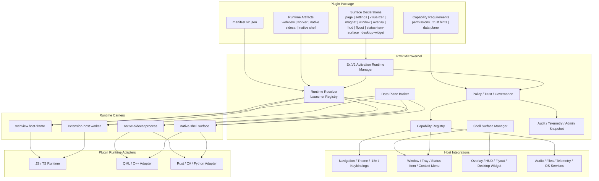
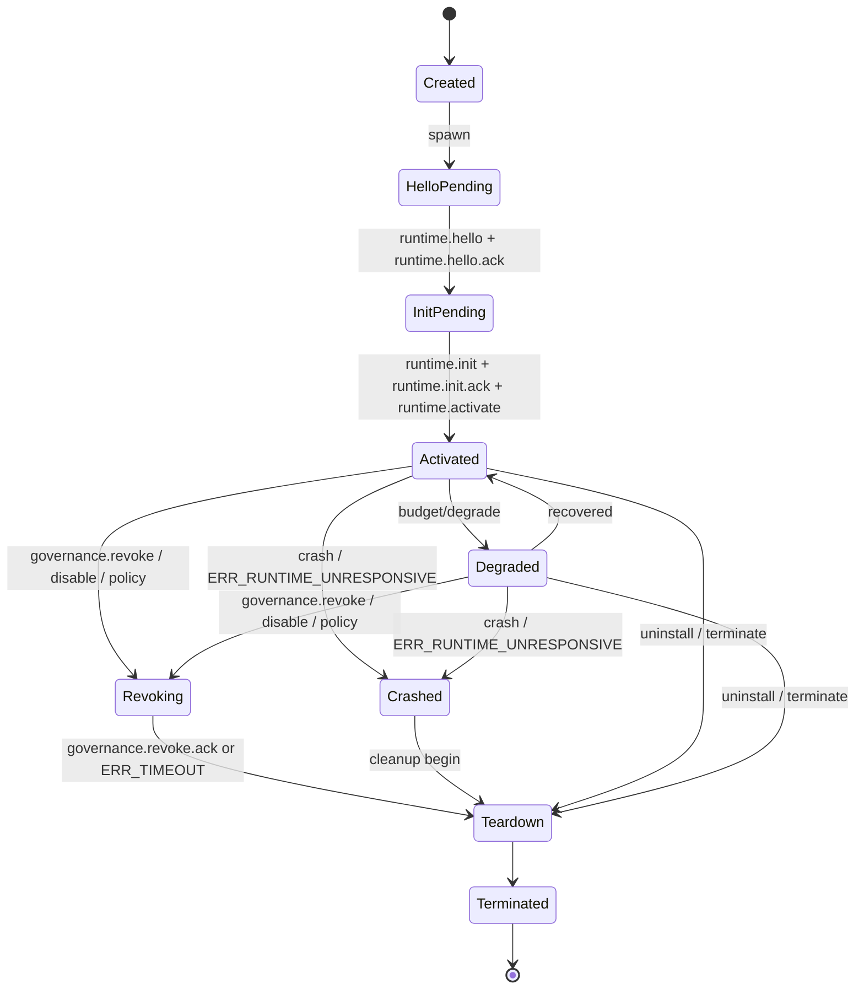
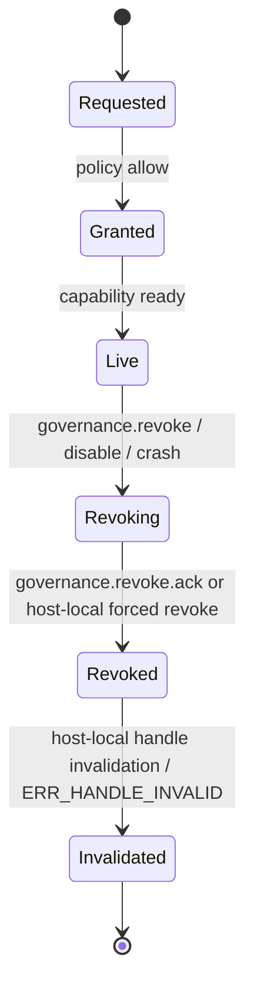
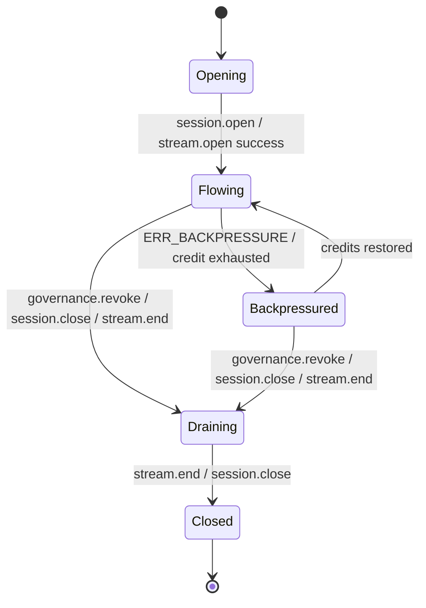
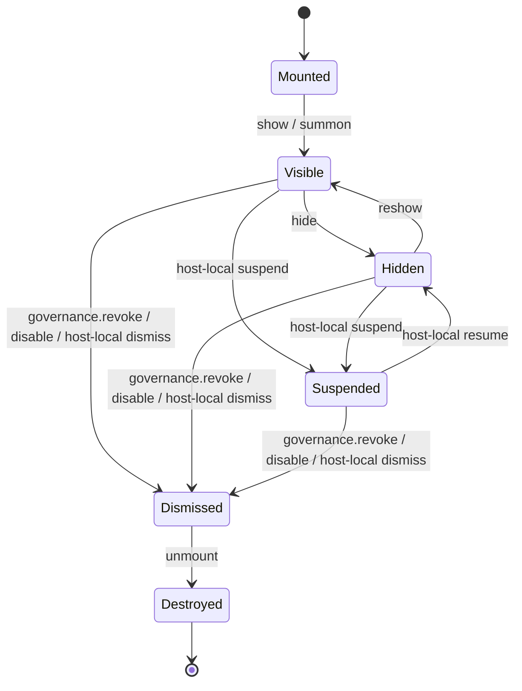
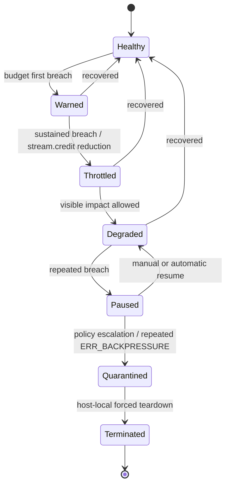
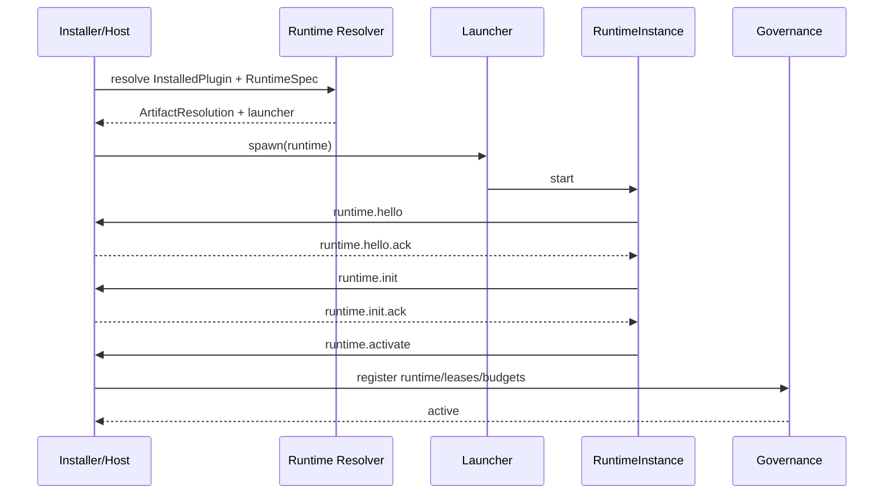
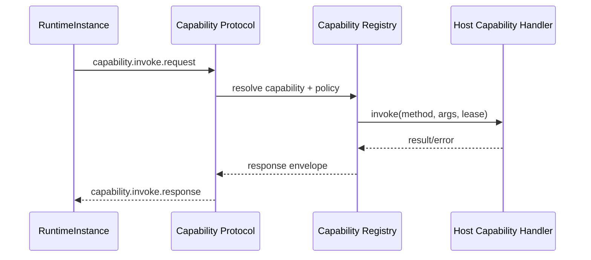
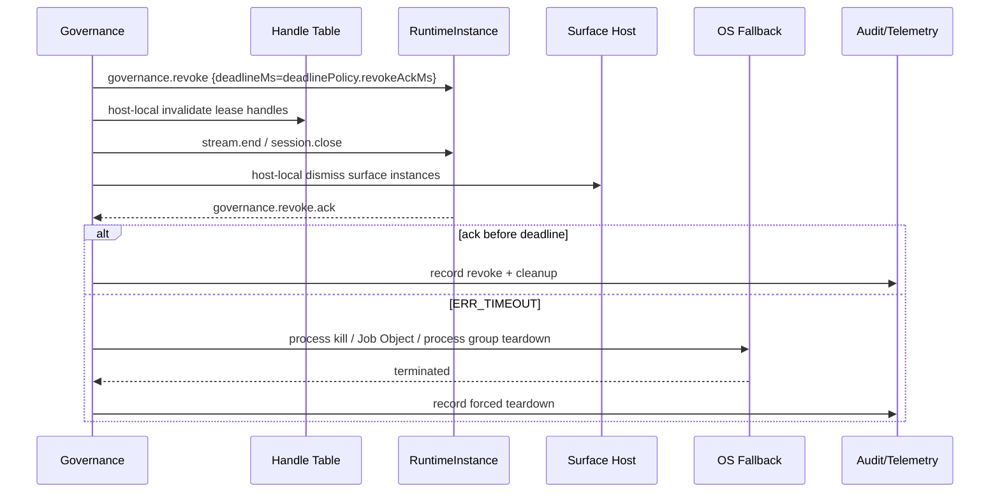
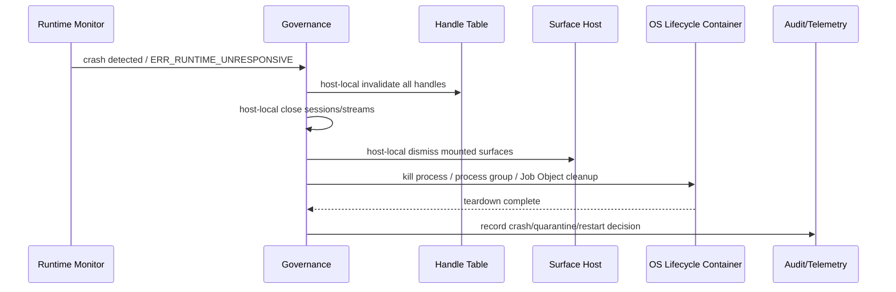

# Plugin Platform Architecture

更新时间：2026-04-09  
原则：**源码与类型定义优先**。本文件只负责插件平台的架构设计、稳定边界与长期演进方向。

当前文档拆分为：

- `documents/plugin-platform.md`：架构设计文档
- `documents/plugin-platform-phases.md`：阶段推进、进度、退出信号与验收基线
- `documents/plugin-platform-preflight.md`：正式扩面前的日志 / 性能 / 共享观测前置完善
- `PLUGIN_PLATFORM.md`：旧根目录副本，已移除

后续若有历史内容需要回溯，请直接使用 Git 历史，不再并行维护多份 plugin 平台主文档。

---

## 0) 文档策略

### 0.1 架构文档职责

这份文档只承担这些职责：

- 说明插件平台的目标架构与稳定边界
- 解释 surface、runtime、capability、data plane、trust 的分层关系
- 记录长期有效的工程约束，而不是短期推进节奏
- 为未来 SAO 类插件与更高阶 runtime 形态提供设计底座

如果任务关注当前进度、阶段排序、退出信号、测试清单、真机手烟或 demo 基线，请改看 `documents/plugin-platform-phases.md`。

### 0.2 V1 北极星与范围收缩

为了避免平台抽象先行过度膨胀，当前建议把 V1 北极星收缩为一句话：

> 让一个第三方插件，稳定地创建一个**受宿主管理**的桌面 `overlay` 或 `desktop-widget`，并通过统一 capability 协议拿到少量原生能力；插件崩溃、撤权、禁用时，宿主能完整回收。

围绕这句话，V1 只做下面三件事：

1. **统一生命周期治理先收口**  
   `activation/lifecycle parity` 是第一优先级，没有这条治理链，后面的 shell surface 都会成为不稳定特权通道。
2. **新 surface 只先落两类**  
   V1 只落 `overlay` 与 `desktop-widget`。  
   `hud / flyout / status-item-surface` 进入 V2 再展开，避免过早把宿主 slot 与交互策略细分到难以维护。
3. **V1 只允许一种高权限原生扩展路径**  
   V1 只开放 `native-sidecar.process` 作为高权限原生扩展入口。  
   原则是：**宿主掌握表面，sidecar 提供能力**。  
   `native-shell.surface` 延后到 V2，再考虑让插件自己拥有真正的原生壳层 surface。

---

## 1) North Star 与目标架构

### 1.1 North Star（硬目标）

- **Kernel First**：宿主只保留最小内核职责，其余能力通过 capability contracts 外挂。
- **Contracts Over APIs**：插件与宿主通过 `capabilityId + protocol envelopes` 交互，不暴露宿主内部实现细节。
- **Sandbox Default**：默认不信任插件；权限显式授予，可拒绝、可撤销、可降级。
- **Polyglot Runtimes**：同一套契约支持 `webview / worker / native sidecar`，不按语言分别设计插件系统。
- **Carrier-Independent**：compat carrier 只是过渡；协议语义必须能复用到 worker/webview/sidecar/native shell。
- **Builtin Convergence**：长期 builtin 与 plugin 在同一 capability 边界同权同构，policy 可以区分信任等级，但不能永久双轨。

### 1.2 交付基线（Definition of Done）

从“插件平台/微内核化”视角，一个里程碑要算完成，至少要能提供这些证据：

- **可运行**：至少 1 个插件实例能走“声明 -> 解析 -> 启动 -> 交互 -> 清理”的全链路。
- **可观测**：settings/admin 能看到 runtime resolution、launcher、carrier、capability grants，或至少能导出 snapshot。
- **可测试**：新增协议、解析、权限规则，必须有对应测试。
- **可降级/可清理**：runtime crash/dispose 时，stream/session/handle/surface mount 等资源必须由宿主回收，并且可审计。

### 1.3 面向 SAO 类插件的目标架构

如果未来要允许第三方或内建插件实现“类 SAO Utils 的超级桌面可视化”，平台目标形态不能只停留在“页面/设置页/独立窗口插件”，而必须补齐一层 **shell-grade plugin platform**：

- **运行时与语言解耦**：平台不按 `QML/C++`、`Rust`、`Python`、`C#` 分别设计；平台只认统一 runtime protocol，语言通过 adapter 接入。
- **surface 与 carrier 解耦**：`overlay / hud / flyout / status-item-surface / desktop-widget` 是 surface；`webview / worker / native-sidecar / native-shell-surface` 是 carrier。
- **能力与实现解耦**：插件声明自己要什么 capability、需要什么 trust level、支持什么 data plane；宿主决定是否授予、如何降级、如何撤权。
- **治理优先于炫技**：所有可召唤 UI、全局快捷键、原生 overlay、状态栏、托盘、实时音频都必须挂在统一 lifecycle / revoke / restart / audit 链上。
- **原生 UI 走协议而不是特判**：QML/C++ 可以是第一批 native-shell adapter，但不是平台唯一特例；平台应允许未来接入任意可实现协议的原生栈。

### 1.4 目标架构图



### 1.5 平台边界与声明面

要支撑 SAO 类插件，插件边界必须显式声明，而且要按下面五层拆开：

| 层 | 插件声明什么 | 宿主管什么 | 备注 |
| --- | --- | --- | --- |
| `surface` | 要挂载的 UI 形态与召唤方式 | slot、z-order、placement、focus、dismiss | 不能再只靠 `page/window/magnet` 变通 |
| `runtime` | 使用哪种 runtime kind / carrier | 解析、启动、预热、隔离、终止、回收 | 平台按 runtime 协议，不按语言做专门分叉 |
| `capability` | 需要的 host 能力、可选能力、撤权容忍度 | 授权、拒绝、撤销、降级、审计 | 必须支持 live revoke |
| `data plane` | 高频数据通道需求 | `inline-json / shared-memory / pipe / local-socket` 协调 | 实时动画和音频不能只靠低频 JSON 轮询 |
| `trust` | sidecar、网络、文件、桌面控制等风险提示 | 签名、校验、policy、quarantine | Native 插件必须有更严格 trust floor |

### 1.6 目标 surface / runtime 模型

**推荐的一等公民 surface 种类**

- `command`
- `page`
- `settings`
- `visualizer`
- `magnet`
- `window`
- `overlay`
- `hud`
- `flyout`
- `status-item-surface`
- `desktop-widget`

**推荐的 runtime / carrier 划分**

- `webview.host-frame`
  - 适合宿主内页面、设置面板、普通可视化、低风险磁贴。
- `extension-host.worker`
  - 适合 command、后台逻辑、轻量状态同步、预热/索引类任务。
- `native-sidecar.process`
  - 适合多语言实现、原生桥接、实时数据、系统级能力、QML/C++ 等 adapter。
- `native-shell.surface`
  - 适合真正的原生 overlay、HUD、status-item surface、desktop widget。

**结论性约束**

- QML/C++ 不应被做成一套独立插件系统，而应作为 `native-sidecar.process` 或 `native-shell.surface` 的一种 adapter。
- “支持所有语言”的方式不是宿主直接理解所有语言，而是宿主定义统一协议，语言实现各自的 runtime adapter。
- V1 默认只开放 `native-sidecar.process`；`native-shell.surface` 保留为 V2 目标，不进入第一阶段实现承诺。

### 1.7 通信、序列化与运行时选型原则

这部分用于回应 native-sidecar / 多语言 / 高频 visualizer 的深水区挑战。

**控制面与数据面必须分离**

- **控制面**：manifest、runtime bridge、capability invoke、session、stream control、audit、governance  
  - 可以接受可读性更高、易调试的 schema-first 消息格式，但必须有明确 framing、版本、超时与错误模型。
- **数据面**：频谱帧、动画帧、批量几何、低延迟状态流  
  - 不允许继续使用 JSON 作为主路径编码。

**序列化建议**

- 控制面初期默认采用：`JSON` 或 `MessagePack over framed transport`。前提不是“人类可读”本身，而是 schema-first、版本可协商、易联调、可审计。
- 高频数据面默认采用：`Protobuf` + 二进制 framing。只有在 profiling 证明确有零拷贝收益时，再引入 `FlatBuffers / Cap'n Proto`。
- `shared-memory` sideband 元数据优先使用固定 header 结构，明确：
  - 字节序
  - 版本字段
  - ring buffer 布局
  - 生命周期 / 回收语义
- 需要极低延迟的 visualizer / widget 场景，应优先配合：
  - `shared-memory`
  - `pipe`
  - `local-socket`
- 原则上：**JSON 只允许留在低频控制面、debug/tracing 与 compat 过渡层，不应进入高频渲染主路径。**

**RPC / Transport 取向**

- 平台核心更适合走：**Named Pipes / Unix domain socket / local socket + 自定义 framed protocol**。
- `gRPC` 可以作为未来某些外部集成或远程宿主场景的 adapter 选项，但不建议成为插件 runtime bridge 的核心。
- `tRPC` 不适合作为跨语言 native-sidecar 主协议。
- 结论上：**核心桥接层不应依赖 gRPC/tRPC，应该由 PMP 自己拥有生命周期、撤权、资源句柄、cleanup 语义。**

**WASM 的定位**

- `WASM Runtime` 值得纳入规划，但它不是 SAO 类 native shell UI 的替代品。
- 更适合的定位是：
  - 高性能计算插件
  - 音频分析
  - 复杂逻辑计算
  - 可移植、低治理成本的 compute runtime
- 因此建议把 WASM 作为 `worker` 与 `native-sidecar` 之间的一条补充运行时，而不是拿来替代 `native-sidecar.process` 或未来的 `native-shell.surface`。

**Native artifact 分发策略**

- 生产态不建议把全平台原生二进制全部塞进单个插件包，也不建议把“联网下载 artifact”塞进 runtime 启动路径。
- 当前推荐策略是：**安装 / 更新期按目标系统解析并拉取匹配 artifact，验签后固化到本地；运行期只执行本地已校验产物。**
- `Launcher Registry` / runtime resolver 负责“选择哪一个 runtime / artifact”，不负责在启动瞬间临时联网补包。
- 本地开发或手工导入场景，可以允许插件包内附带单平台 artifact，作为无市场环境下的调试便利路径，但不应反推成生产主模式。
- 长期需要在 manifest / store artifact matrix 中补齐这些维度：
  - `os`
  - `arch`
  - `libc / abi`
  - `distributionChannel`
  - `digest / signature / notarization`

**Native sidecar 进程治理**

- 原生 sidecar 的 cleanup 不能只依赖协议层 `dispose / revoke`，还必须有 OS 级生命周期兜底。
- Windows 上宿主拉起 sidecar 时，应强制绑定 `Job Object`。
- macOS / Linux 上宿主应使用独立 `process group`，并把 teardown / kill / host crash recovery 挂到进程组级别。
- 目标不是“尽量清理”，而是确保宿主异常退出、live revoke、强制 terminate 时，OS 仍能回收 sidecar 的子进程、句柄与关联资源。
- 对全局快捷键 hook、共享内存锁、托盘图标、隐形窗口这类系统资源，默认优先通过宿主 capability 代理持有；如果 sidecar 直接持有，宿主必须把“进程回收”视为最后一道强制清理边界。

### 1.8 上线指标与验收基线（目标值，不代表当前已达成）

| 维度 | 目标基线 | 验收口径 |
| --- | --- | --- |
| 激活治理 | `onStartup / onCommand / onView / onCapability / onHost / onFile` 全部进入统一 manager | 不允许再分散在多个 host runner 各自处理 |
| 生命周期 | `restart / disable / unresponsive / deny / revoke / quarantine / terminate` 统一审计 | 每个 runtime instance 都能导出 lifecycle snapshot |
| 权限撤销 | live revoke 后 `2s` 内收到 ack，超时由宿主强制 teardown | 需覆盖 webview、worker、sidecar 三类 carrier |
| 崩溃隔离 | 插件崩溃不得拖垮宿主；资源回收应在 `5s` 内完成 best-effort 清理 | 校验 session、stream、handle、surface mount 清理 |
| 可观测性 | 每个运行实例必须记录 `pluginId/runtimeId/runtimeInstanceId/launcherId/carrier/grants/lastError` | settings/admin 可见或可导出 |
| 性能 | `command` 冷启动目标：worker `<= 500ms`，sidecar `<= 1000ms`；长生命周期 surface 首帧目标 `<= 1200ms` | 以标准真机 profile 手烟验证 |
| 召唤式 UI | warm summon 目标 `<= 150ms`，cold summon 目标 `<= 800ms` | 仅针对 `overlay/hud/flyout/native-shell.surface` |
| 实时数据 | `60Hz` 级动画/频谱路径必须可走 stream 或更高效 data plane | 不允许只靠低频 JSON 轮询凑效果 |
| 可移植性 | manifest 必须声明 `platform/arch/runtime/trustHints`；宿主必须 capability negotiate | Windows/macOS/Linux 不支持的能力必须可降级 |
| 原生产物治理 | Native sidecar / shell adapter 必须有 digest、签名或等价信任校验入口 | 不允许“任意二进制直接跑”成为默认路径 |
| 原生分发 | 生产态 native artifact 必须在安装/更新期按 `os/arch/libc/abi` 解析并固化 | 运行期禁止临时联网拉取未知二进制 |
| 进程回收 | native-sidecar 必须绑定 OS 级生命周期容器 | Windows 校验 `Job Object`；macOS/Linux 校验 `process group` 清理 |
| 联调可见性 | native-sidecar 真机联调前必须具备协议抓包与耗时可视化能力 | 至少可观察 `control/data/trace` 三通道 |
| UX 一致性 | shell surface 必须服从宿主的 focus、Escape、z-order、multi-monitor、DPI 规则 | 不能让插件私自绕开宿主窗口治理 |

### 1.9 SAO 类插件的最小平台能力清单

如果后续要做“PMP 自己的 SAO 类插件”，平台至少要具备下面这些正式能力：

- `shell-surface.mount/unmount/show/hide/focus`
- `shell-surface.describeSlots/listSurfaces/getState`
- `global-shortcut.register/unregister`
- `host.pmp.shell.status-item` 真正可挂载，而不是 placeholder
- `overlay.material/blur/vibrancy` 能力协商
- `overlay.pointer-pass-through` 与 `capture-input` 的冲突治理
- `desktop-widget` 的多屏定位、DPI、always-on-top、sleep/resume 恢复
- `high-frequency-audio` 或等价实时 data plane
- `native-sidecar` 的签名、trust floor、异常恢复和 quarantine
- `admin snapshot` 对 runtime / permission / revoke / crash / cleanup 全链路可观测

### 1.10 ShellSurfaceManager 的实现约束

`ShellSurfaceManager` 的优先级必须很高，而且需要明确这几条工程约束：

- 它必须在 Rust/C++ 侧直接与原生系统窗口 API 握手，不能把窗口层级、点击穿透、多屏定位这些控制责任下放给 Webview。
- V1 应优先攻克单一平台的边界测试，建议先以 Windows Win32 API 为首个平台。
- `Win + D`、动态桌面、Z-order 漂移、多显示器热插拔、DPI 动态切换、睡眠恢复，都必须纳入手烟与回归项。
- shell surface 的核心验证必须发生在真实物理机上，而不是只在虚拟机里做 happy path；至少覆盖多屏、高低 DPI 混搭、显示器热插拔与系统壁纸/桌面状态切换。
- 插件不能直接创建不受宿主管理的原生顶层 UI；所有 shell surface 都必须向宿主登记并服从统一 focus / dismiss / revoke / cleanup 规则。

### 1.11 面向“300% 极致形态”的长期跃迁路径

如果目标不是“工业级可落地”而是“极致完备 + 极致轻巧”的下一代桌面宿主，那么当前架构还可以继续沿四条长期主线演进。但这些能力应视为 **V2/V3 级前瞻路线**，不反向挤占当前 V1 的 activation/runtime、sidecar 加固与 shell-surface 基线。

**总原则：从纯粹微内核转向混合分层内核**

- 不把“所有东西都丢进 OS 进程/Webview”当成终态。
- 也不把“所有东西都收回宿主进程”当成终态。
- 更合理的极致模型是：**热路径尽量进宿主受控沙箱，重权限能力才进入 sidecar，重表现能力才进入受管 surface。**

**跃迁一：计算平面 -> `wasm.component` / nano-process**

- 长期建议把 `WASM Component Model` 作为默认 compute runtime，承接绝大多数无高权限、无原生 UI 的插件逻辑。
- 目标不是替代所有 runtime，而是形成新的默认梯度：
  - `wasm.component`：默认轻量计算路径
  - `extension-host.worker`：现有 JS/TS 过渡与生态兼容
  - `native-sidecar.process`：系统集成、原生依赖、提权逃生舱
  - `native-shell.surface`：未来真正原生壳层 UI
- 这样可以把“轻量、跨平台、可沙箱、可热销毁”的能力前移到宿主内，而不是默认为每个挂件付出 OS 进程级成本。
- 但这条路线应建立在：
  - 组件模型 ABI 稳定
  - 宿主有 precompile/cache 策略
  - 调度与资源预算可观测
  - 与现有 capability protocol / handle model 可衔接

**跃迁二：数据平面 -> 零拷贝 ring buffer + 限制型算法注入**

- 长期高频路径不应停留在“消息传输 + 插件自行算完再回传”的模式。
- 在 visualizer、桌面动画、音频分析这类超高频场景，应演进到：
  - `shared-memory ring buffer`
  - 固定 header / sideband control
  - 零拷贝读取的二进制 schema
- `Cap'n Proto / FlatBuffers` 更适合作为这条超高频路径的未来选项，而不是一上来替换全部控制面。
- 更进一步，可以借鉴 eBPF 的思想，但在用户态安全收敛为：**限制型 host-injected compute kernels**。
- 也就是说，不是把任意插件逻辑塞进音频热环路，而是允许插件提交：
  - 可验证
  - 有资源预算
  - 无宿主回调依赖
  - 可随时中断
  的小型计算核，由宿主在热路径内执行。
- 这条路线更适合 Phase 2.7 之后的性能深水区，而不是当前 sidecar MVP 的默认要求。

**跃迁三：UI 表现层 -> scene protocol 驱动的宿主直绘**

- 对 `overlay / desktop-widget` 这类 ambient UI，长期不应默认绑定一整套 Webview/Chromium 引擎。
- 更极致的形态是：插件只输出 scene/state protocol，宿主通过轻量渲染器直接绘制。
- 这条路线的价值在于：
  - 降低 Webview 常驻显存/内存占用
  - 更容易控制 z-order、透明、点击穿透、桌面贴附
  - 更一致地接入宿主题材、动画、DPI 与多屏规则
- 但要明确边界：
  - `settings/page/window` 这类复杂文档型 UI，短中期仍适合 `webview.host-frame`
  - `overlay / desktop-widget` 才适合优先试点 scene protocol
- 因此更合理的长期分层不是“全部 native render”，而是：
  - 文档型 UI：Webview
  - 轻量 ambient UI：host-rendered scene protocol
  - 原生专属 UI：future `native-shell.surface`

**跃迁四：安全治理 -> OCap / handle-first 运行时模型**

- manifest 里的字符串权限声明仍然有价值，但它更适合作为安装期声明、策略 UI 与审计文案，而不是运行期最终安全边界。
- 长期运行时应转向 `Object-Capability` 风格：
  - 宿主授予的不是抽象“通行证”，而是具体资源句柄 / lease
  - 插件拿到的是不可伪造、与 runtime instance 绑定的 opaque handle
  - live revoke 的本质是宿主销毁 handle table 中的有效项
  - 后续访问直接得到 `ERR_HANDLE_INVALID`
- 这与当前文档里的 `handle.*` 家族是同方向的，应继续往“handle-first runtime”推进，而不是停留在 ACL 字符串校验。
- 但在跨 JS / WASM / native runtime 场景里，应把“不可伪造”理解为：
  - 宿主维护唯一 handle table
  - handle 与 `pluginId/runtimeInstanceId/leaseId` 绑定
  - 句柄不可猜测、不可跨 runtime 复用
  - 所有销毁、续租、撤销都可审计

**长期采纳顺序建议**

- 第一优先级仍是当前主线：统一 activation/runtime、sidecar 加固、shell-surface 基线、Tracer 前置。
- 第二优先级是把 `handle.*` 与 runtime governance 做成真正的一条链，为 OCap 路线打地基。
- 第三优先级才是引入 `wasm.component` 作为默认轻量 compute runtime。
- 第四优先级是在 `overlay / desktop-widget` 上试点 scene protocol / host-rendered widget。
- 最后才进入限制型 hot-path compute kernel，把“算法下沉”引入宿主热环路。

**在上述四条长期主线之上，还可以继续沿四个 V4 级 research track 前进**

这些方向更接近“桌面操作环境内核”的研究路线，而不是常规插件平台功能。它们的共同前提是：**只有在 V1/V2 已证明治理、Tracer、预算、回退机制都成立之后，才值得进入实验。**

**Research Track A：表现层 -> 从宿主直绘到硬件混成器后端**

- scene protocol 的下一跳，不一定还是“宿主自己画到普通窗口里”，而可以进一步下沉到系统混成器 API：
  - Windows：`DirectComposition`
  - macOS：`CoreAnimation Layer Tree`
- 长期目标不是继续 hack 透明窗口，而是把 `overlay / desktop-widget / status-item-surface` 这类 ambient UI 映射为更底层的 composition tree。
- 更激进的方向可以探索 `Multi-Plane Overlay (MPO)` 一类硬件叠加平面，让部分 surface 直接进入 GPU 显示合成路径。
- 但必须诚实写清：
  - `MPO` 受 GPU、驱动、HDR、显示链路、系统版本影响极大
  - 它应被视为 opportunistic backend，而不是跨平台恒成立的保证
  - 任何 compositor / MPO 路径都必须保留回退到 host-rendered scene 的能力
- 所以更合理的文档口径是：**先定义 scene protocol，再让不同平台在 backend 层决定是否能下沉到 compositor / MPO。**

**Research Track B：计算与数据面 -> 异构纳米沙箱（WASM + GPU compute）**

- 在 `wasm.component` 成为默认轻量 compute runtime 后，下一步可以把高频计算继续下沉到 GPU。
- 长期 `Data Plane Broker` 不仅分配 CPU 侧共享内存，也可以分配 GPU buffer / texture 句柄。
- 插件除了提交 WASM 逻辑，还可以在严格约束下提交 `WGSL` compute kernels，由宿主在 GPU 上执行：
  - 频谱
  - 粒子模拟
  - 高刷几何动画
  - 图像 / 视频预处理
- 理想链路是：
  - 数据直接进入 GPU buffer
  - compute shader 在 GPU 内完成变换
  - 输出直接喂给 compositor / host-rendered scene
- 但这条路线只有在以下条件满足时才可行：
  - shader ABI、资源布局、同步模型可契约化
  - kernel 可验证、可预算、可中断
  - 不支持 GPU compute 的平台必须能自动回退到 WASM / CPU 路径
- 换句话说，这不是“让插件自由跑 GPU”，而是**受治理的 GPU compute capability**。

**Research Track C：能力层 -> 神经符号总线（Neuro-Symbolic Bus）**

- 当前 `host.pmp.*` 偏机械能力边界；长期如果平台承载 AI 资产管理、知识检索、内容生成、桌面代理，就需要引入 AI-native capability。
- 更合理的演进不是让每个插件各自带模型，而是宿主维护共享的智能底座：
  - 本地 embedding / rerank / summarization service
  - 统一向量索引与 memory store
  - 轻量本地推理后端（例如 ONNX / WASM / 未来本地 NPU 适配）
- 对外可以逐步形成：
  - `host.intelligence.embedText`
  - `host.intelligence.rerank`
  - `host.memory.ragQuery`
  - `host.memory.upsert`
  - `host.automation.plan`
- 这样插件共享的是宿主的认知能力，而不是各自复制一套 AI 依赖栈。
- 但这里的底线约束必须更强：
  - 数据域隔离
  - 明确 consent / scope
  - 审计可追踪
  - 本地 / 云端推理边界显式声明
- 所以文档上应把它视为“语义 capability bus”，而不是普通 RPC 家族的随意扩张。

**Research Track D：安全与分发 -> 确定性组件 / IR-first 分发**

- 在 `native artifact + 安装期解析` 这条现实路径之上，长期还可以探索更激进的分发模型：
  - 宿主接收的是受约束 IR / recipe / component
  - 在安装期或首次激活期完成 AOT 编译
  - 编译结果按当前机器硬件与系统特征缓存
- 这条路线与 Nix/Flakes 的精神更接近：重现性、依赖可声明、状态可推导，而不是传统黑盒二进制分发。
- 它的潜在收益是：
  - 降低 native dependency hell
  - 做到更强的静态分析与安全检查
  - 为 `wasm.component`、scene kernel、compute kernel 提供统一的缓存与构建入口
- 但必须明确：在相当长一段时间里，这条路线只应该是**补充轨道**，而不是取代当前签名原生产物分发的主线。
- 也就是说，现实主线仍然是：
  - 当前：已签名 artifact + 安装期解析
  - 未来：IR-first / deterministic component 作为高阶可选分发模式

**更高阶的长期采纳顺序建议**

- 先完成 V1/V2：activation/runtime、sidecar 加固、shell-surface、Tracer、OCap 基线。
- 再推进 `wasm.component` 与 handle-first runtime，让“轻量 compute + 强治理”成立。
- 然后试点 scene protocol 的 compositor backend 与受治理 GPU compute。
- 在此之后，才值得引入 `host.intelligence.*` 这类语义 capability bus。
- 最后再探索 deterministic component / IR-first 分发，把它作为成熟平台的高阶演化，而不是当前主线的前置条件。

### 1.12 Kernel Constitution（平台宪法）

这一节是插件平台的最上位硬法。后续任何 runtime、surface、capability、adapter、protocol 扩展，都不得违反下面这些原则。

1. **默认轻路径法**  
   默认 runtime 必须走最轻路径；除非 declarative、host-rendered、`wasm.component`、`worker` 都不能满足要求，否则不得默认进入 `native-sidecar.process`。
2. **宿主管表面法**  
   所有 surface 必须受宿主管理；插件不得创建野生顶层 UI，不得绕开 host 的 focus、dismiss、z-order、multi-monitor、DPI 与 revoke 规则。
3. **句柄优先法**  
   所有高权限能力必须 lease / handle 化；不得向插件直接暴露宿主对象引用作为最终安全边界。
4. **协议同族法**  
   所有 carrier 必须共享同一 `runtime.* / capability.* / session.* / stream.* / handle.* / governance.* / audit.*` protocol family，不得私长 verb 家族。
5. **冷热面分离法**  
   控制面与数据面必须分离；不得让 JSON 进入高频热路径，不得让 tracing 污染主控制面。
6. **可撤销可审计法**  
   所有 capability 都必须支持 live revoke，并能把 cleanup、超时、forced teardown 写入 audit。
7. **安装期解析法**  
   所有 native artifact 必须在安装/更新期解析、验签、固化；运行期禁止临时联网补包并直接执行未知产物。
8. **新能力四问法**  
   所有新能力先问：能否 declarative、能否 host-rendered、能否 `wasm/worker`、能否 lease/handle 化；只有都不行，才允许 sidecar 或 future native-shell 路径。

这 8 条不是“建议”，而是平台膨胀的防火墙。

### 1.13 Runtime Budget & QoS Model

平台若想做到“完备而轻量”，不能只治理生命周期，还必须治理资源预算。`ExtV2 Activation Runtime Manager` 长期应内建一层 **Budget Governor**，作为 runtime governance 的组成部分，而不是外围监控。

**预算维度**

| 预算 | 作用域 | 默认关注点 |
| --- | --- | --- |
| `cpuBudget` | runtime instance / plugin / surface group | 后台常驻、突发峰值、热路径占用 |
| `memoryBudget` | runtime instance / plugin / host aggregate | 常驻内存、峰值、泄漏趋势 |
| `startupBudget` | runtime instance | cold start、warm resume、activation latency |
| `idleBudget` | runtime instance / surface | 空闲占用、隐藏态占用、后台滴答 |
| `frameTimeBudget` | surface / render lane | 帧时间、jank、掉帧 |
| `streamBandwidthBudget` | session / stream | 高频数据流吞吐、回压、丢帧策略 |
| `revokeAckDeadline` | capability lease / runtime instance | live revoke 的响应期限 |
| `surfaceRenderBudget` | surface instance | first paint、steady-state repaint、动画预算 |

**超预算策略**

Budget Governor 的默认升级序列应是：

1. `warn`
2. `throttle`
3. `degrade`
4. `pause`
5. `quarantine`
6. `terminate`

**预算治理原则**

- 默认先局部处置，再全局处置；优先 throttle 某条 stream，而不是直接杀整个插件。
- 默认先 degrade 表现层，再升级到 runtime terminate；例如先降刷新率、关特效、降采样。
- 任何预算动作都必须可观测，至少写入 telemetry / audit，并关联 `pluginId/runtimeInstanceId/surfaceId/sessionId`。
- `revokeAckDeadline` 与资源预算一样，是硬预算，不得因为“插件仍在忙”而无限延长。
- 预算机制必须与 policy / trust 结合；高权限插件超预算的容忍度应更低，而不是更高。

### 1.14 Runtime Ladder（默认轻量梯度）

平台默认不按“语言”分级，而按 runtime 重量、治理成本和宿主控制度分级。

| 等级 | 名称 | 典型形态 | 默认能力边界 |
| --- | --- | --- | --- |
| `L0` | Declarative Plugin | manifest + scene/state，无常驻逻辑 | 宿主解释、宿主渲染、无高权限 |
| `L1` | Compute Plugin | `wasm.component` / `extension-host.worker` | 轻量计算、受限 capability、可热销毁 |
| `L2` | Interactive Surface Plugin | 受管 `overlay / desktop-widget`、host-frame surface | 交互表面、宿主掌控 focus / render / lifecycle |
| `L3` | Privileged Native Plugin | `native-sidecar.process` / future `native-shell.surface` | 系统集成、原生依赖、高权限能力 |

**升格原则**

- 插件默认只能从低层级申请向高层级“升格”，不能默认落在高层级。
- `L0 -> L1` 的理由通常是需要逻辑、状态、索引或轻量计算。
- `L1 -> L2` 的理由通常是需要可召唤、可见、受管的互动表面。
- `L2 -> L3` 的理由必须能明确证明：需要系统级 API、原生依赖、驱动/服务集成，且无法被 declarative / host-rendered / wasm / worker 路径覆盖。

### 1.15 Runtime Object Model

平台的核心对象关系必须固定下来，否则 lifecycle、revoke、cleanup 最后会在实现里散成隐式状态机。

**核心对象**

| 对象 | 含义 | 所有权 |
| --- | --- | --- |
| `PluginPackage` | 插件包本体与静态元数据 | 安装器 / store |
| `InstalledPlugin` | 当前 host 上的已安装记录 | 宿主 |
| `RuntimeSpec` | manifest 中声明的某个 runtime 描述 | `InstalledPlugin` |
| `ArtifactResolution` | 当前机器命中的本地产物解析结果 | 宿主 |
| `RuntimeInstance` | 一次真实激活出的运行实例 | 宿主 |
| `SurfaceInstance` | 某个 runtime instance 挂载出的受管表面 | 宿主 |
| `CapabilityLease` | 授予某个 runtime instance 的能力租约 | 宿主 |
| `Session` | 绑定到某 capability 的长生命周期交互 | 宿主与 runtime 共识，宿主裁决 |
| `Stream` | 绑定到某 session 或 capability 的数据流 | 宿主与 runtime 共识，宿主裁决 |
| `Handle` | 绑定到 lease 的 opaque 资源句柄 | 宿主 |
| `AuditRecord` | 生命周期、撤权、预算、错误、恢复记录 | 宿主 |

**对象关系**

- 一个 `PluginPackage` 在某个 host/profile 上安装后，形成一个 `InstalledPlugin`。
- 一个 `InstalledPlugin` 可声明多个 `RuntimeSpec`，并在安装期得到一个或多个 `ArtifactResolution`。
- 一个 `RuntimeSpec` 可以生成多个 `RuntimeInstance`。
- 一个 `RuntimeInstance` 可以挂多个 `SurfaceInstance`。
- `CapabilityLease` 必须绑定到具体 `RuntimeInstance`，而不是只绑定插件 id。
- `Handle` 必须绑定到 `CapabilityLease + RuntimeInstance`，不得脱离 lease 独立存活。
- `Session / Stream` 必须绑定到具体 capability 与 runtime instance，不得成为游离对象。

**级联销毁规则**

- `revoke lease`：先使 `Handle` 失效，再关闭 `Stream`，再关闭 `Session`，最后视需要卸载相关 `SurfaceInstance`。
- `disable plugin`：终止该 `InstalledPlugin` 下所有 `RuntimeInstance`，并级联销毁其 `Lease / Session / Stream / Handle / SurfaceInstance`。
- `runtime crash`：标记 `RuntimeInstance` 崩溃，强制失效其 `Handle`，关闭其 `Session / Stream`，卸载其 `SurfaceInstance`，并写入 `AuditRecord`；必要时升级到 quarantine。

### 1.16 Adapter Contract Families

平台兼容性的单位不是“语言”，而是 **adapter contract family**。

| 家族 | 职责 | 典型载体 |
| --- | --- | --- |
| `Compute Adapter` | 轻量计算、索引、分析、受限业务逻辑 | `wasm.component`、`extension-host.worker`、未来受限脚本 adapter |
| `Native Service Adapter` | 系统 API、原生依赖、后台服务集成 | `native-sidecar.process` |
| `Surface Adapter` | 可视表面承载与渲染接入 | `webview.host-frame`、scene protocol、future `native-shell.surface` |

**平台规则**

- 语言实现应“归属某个 adapter family”，而不是要求平台为每种语言开一套插件系统。
- `QML/C++`、Rust、Python、C# 都只是某种 family 的实现方式，不是平台一等概念。
- 新语言接入首先要回答的不是“宿主支不支持这门语言”，而是“它属于哪个 adapter contract family、遵守什么 contract”。

### 1.17 Scene Protocol Sketch

`scene protocol` 不应只停留在方向层，至少需要一个最小契约草图。

**最小对象**

- `SceneRoot`
- `Node`
- `Layout`
- `Paint`
- `Animation`
- `InputPolicy`
- `HitTestMode`
- `ResourceRef`
- `StateDiff`

**最小语义**

- `SceneRoot`：场景根节点、版本、尺寸策略、主题挂钩。
- `Node`：稳定 id、节点类型、子树关系。
- `Layout`：box/flex/grid/anchor 等受限布局模型。
- `Paint`：fill/stroke/text/image/material 等绘制描述。
- `Animation`：transition/timeline/state-driven animation。
- `InputPolicy`：focusable、pointer events、capture、keyboard routing。
- `HitTestMode`：auto / pass-through / opaque / region-defined。
- `ResourceRef`：字体、图片、shader、图标、系统材质等宿主管资源引用。
- `StateDiff`：以 patch / subtree replace 形式更新场景，而不是每帧全量重建。

**边界约束**

- `scene protocol` 只用于 `overlay / desktop-widget`，不覆盖 `settings/page/window`。
- 宿主拥有最终的 z-order、focus、pointer-pass-through、DPI、multi-monitor 决策权。
- 插件只能声明想要的 scene/state，不能借 scene protocol 绕开宿主窗口治理。

### 1.18 Compatibility & Deprecation Policy

平台必须像 OS 一样给出兼容性与废弃承诺，而不是只做版本协商。

**兼容性原则**

- manifest `major` 变更才允许 breaking schema 变化；同一 `major` 内只允许增加字段或增加可选能力。
- protocol `major` 表示不兼容语义变更；protocol `minor` 只允许向后兼容扩展。
- capability family 的方法或字段弃用，必须经历“标记弃用 -> 告警 -> 冻结新增 -> 移除”的窗口。
- compat carrier 必须先冻结新增能力，再进入只读维护，最后才允许退场。

**产品化承诺**

- 插件市场应校验插件声明的最低宿主版本，并向用户暴露兼容区间。
- 宿主升级时，`InstalledPlugin` / `InstalledRecord` 迁移必须：
  - 幂等
  - 可审计
  - 对未知字段尽量保留
  - rollback 至少 best-effort
- 废弃策略必须写入 release notes / audit / diagnostics，而不是只在代码里静默移除。

### 1.19 Footprint Baseline

“轻量”必须变成正式指标，而不是哲学口号。下面这些值是长期目标基线，不代表当前已经达成。

| 指标 | 目标值 | 说明 |
| --- | --- | --- |
| `L0 declarative widget` 单实例增量常驻内存 | `<= 2 MB` | 以 host-rendered scene 为理想形态 |
| `L1 wasm.component` 单实例增量常驻内存 | `<= 4 MB` | 轻量 compute baseline |
| `L1 worker` 单实例增量常驻内存 | `<= 16 MB` | 作为 JS/TS 生态过渡上限 |
| `overlay / widget` idle CPU | 单 surface `<= 0.5%` | 隐藏态应接近 0 |
| 单 surface 首帧目标 | `<= 1200 ms` | 与现有 first paint 目标一致 |
| 100 个轻量 widget 聚合占用 | 增量内存 `<= 200 MB` | 目标是证明 scale 下仍可控 |
| sidecar 启动后未激活 idle footprint | `<= 40 MB RSS` | native 路径必须被约束，而不是默认放纵 |
| Tracer 开关影响上限 | 开启后 CPU 开销 `< 5%`，内存增量 `< 10%` | 指采样/诊断态，不含极端全量抓包 |

这些指标最终应与 `Budget Governor` 接轨，而不是停留在纸面上。

### 1.20 Core State Machines

对象模型、协议与治理规则只有在状态跳转被固定后，才真正具备可施工性。下面这些状态机定义的是平台的**规范性跳转骨架**，实现可以加细节状态，但不能违背这些主跳转。

命名约定：

- 下面图里的协议事件名，默认对齐 `3.4 Capability protocol` 中的 `messageType`。
- 如果某个动作是宿主本地治理动作而不是公开 protocol verb，会显式标记为 `host-local`。
- 超时与错误名默认对齐：`deadlinePolicy.revokeAckMs`、`ERR_TIMEOUT`、`ERR_RUNTIME_UNRESPONSIVE`、`ERR_BACKPRESSURE`、`ERR_HANDLE_INVALID`。

**RuntimeInstance lifecycle**



**CapabilityLease lifecycle**



**Session / Stream lifecycle**



**SurfaceInstance lifecycle**



**Budget Governor escalation**



### 1.21 Reference Sequences

消息样例描述的是包结构；时序图描述的是主权与跳转顺序。下面四条链路是平台最核心的参考时序。

**插件冷启动时序**



**capability invoke 时序**



**live revoke 时序**



**sidecar crash / forced teardown 时序**



### 1.22 Manifest / Contract Minimum Profile Matrix

为了让这份文档兼具 authoring spec 价值，下面给出四类标准插件模板的最小草图。它们不是完整 schema，只是“平台作者最小面”的锚点。

**Profile 规范表**

| Profile | 标签 | schemaVersion | runtime kind | surface posture | capability posture | default data plane | budget class | artifact posture |
| --- | --- | --- | --- | --- | --- | --- | --- | --- |
| `L0 declarative widget` | `Planned / V2` | future `2.x` profile extension | none / host-rendered scene | 宿主管理、声明式、无常驻逻辑 | 尽量 0 capability；只允许低风险 declarative resource refs | none / `state diff` | `ultra-light` | 无 native artifact |
| `L1 wasm compute plugin` | `Experimental / Research` | future `2.x` profile extension | `wasm-component` | 无表面或受限输出 | 低权限、无高风险 host object、lease-first | `inline-binary` | `light` | portable component / IR |
| `L1 worker plugin` | `Normative / Required` | `2.0` | `extension-host` | 无表面或 command/startup oriented | 受限 capability、host supervised | `inline-json` for low-frequency control; `inline-binary` preferred for data | `light` | no native artifact |
| `L2 overlay widget` | `Planned / V2` | future `2.x` profile extension | `webview` or scene backend | 受管 `overlay / desktop-widget` | 中低权限；表面与输入最终裁决权在宿主 | `inline-binary` / `pipe` | `medium` | no native artifact by default |
| `L3 native-sidecar plugin` | `Planned / V2` | `2.0` | `sidecar` | 无表面，或通过受管 surface 协议接入 | 高权限、强治理、强审计、lease/handle required | `pipe` / `local-socket` / `shared-memory` | `privileged` | install-time resolved + verified artifact |

**Profile 规范规则**

- `L0` / `L1` / `L2` / `L3` 是平台 authoring 层级，不是语言分类。
- 当前正式落在 `schemaVersion: 2.0` 主线里的，是 `L1 worker plugin` 与 `L3 native-sidecar plugin`。
- `L0 declarative widget`、`L1 wasm compute plugin`、`L2 overlay widget` 仍需要后续 schema/profile 扩展，因此属于 `Planned / V2` 或 `Experimental / Research`。
- 即便某 profile 当前尚未进入 `2.0` schema，它的 capability posture、budget class 与 artifact posture 仍然是未来 authoring spec 的约束锚点。

**`L0 declarative widget` 最小草图**

```jsonc
{
  "schemaVersion": "2.0",
  "kind": "extension",
  "identity": { "id": "demo.widget.clock", "publisher": "pmp", "version": "0.1.0", "name": "Clock" },
  "hostTargets": [{ "hostId": "pmp", "required": true }],
  "runtimes": [],
  "contributes": {
    "host": {
      "pmp": {
        "desktopWidgets": [
          { "id": "clock", "scene": "scene://clock-root" }
        ]
      }
    }
  }
}
```

**`L1 wasm compute plugin` 最小草图**

> 未来 profile，示意 `wasm.component` 接入形态；当前 `2.0` schema 尚未正式支持。

```jsonc
{
  "schemaVersion": "2.0",
  "kind": "extension",
  "identity": { "id": "demo.compute.fft", "publisher": "pmp", "version": "0.1.0", "name": "FFT Compute" },
  "hostTargets": [{ "hostId": "pmp", "required": true }],
  "runtimes": [
    {
      "runtimeId": "main",
      "kind": "wasm-component",
      "entry": "dist/fft.wasm",
      "sandbox": "strict",
      "dataPlane": { "kinds": ["inline-binary"] }
    }
  ],
  "requiresCapabilities": [
    { "capabilityId": "host.pmp.audio-engine.analysis" }
  ],
  "activationEvents": ["onStartup"]
}
```

**`L2 overlay widget` 最小草图**

> 未来 profile，示意受管 overlay/widget 的 authoring 形态；当前 `overlay` 仍处于 V2 规划。

```jsonc
{
  "schemaVersion": "2.0",
  "kind": "extension",
  "identity": { "id": "demo.overlay.weather", "publisher": "pmp", "version": "0.1.0", "name": "Weather Overlay" },
  "hostTargets": [{ "hostId": "pmp", "required": true }],
  "runtimes": [
    {
      "runtimeId": "ui",
      "kind": "webview",
      "entry": "dist/index.html",
      "sandbox": "host-supervised",
      "dataPlane": { "kinds": ["inline-json"] }
    }
  ],
  "contributes": {
    "host": {
      "pmp": {
        "overlays": [
          { "id": "weather-overlay", "runtimeId": "ui" }
        ]
      }
    }
  },
  "activationEvents": ["onView:weather-overlay"]
}
```

**`L3 native-sidecar plugin` 最小草图**

```jsonc
{
  "schemaVersion": "2.0",
  "kind": "extension",
  "identity": { "id": "demo.sidecar.native", "publisher": "pmp", "version": "0.1.0", "name": "Native Sidecar Demo" },
  "hostTargets": [{ "hostId": "pmp", "required": true }],
  "runtimes": [
    {
      "runtimeId": "main",
      "kind": "sidecar",
      "entry": "bin/demo-sidecar",
      "platform": ["windows", "macos", "linux"],
      "arch": ["x64", "arm64"],
      "sandbox": "native",
      "dataPlane": { "kinds": ["pipe", "local-socket"] }
    }
  ],
  "requiresCapabilities": [
    { "capabilityId": "host.pmp.navigation" }
  ],
  "trustHints": {
    "requiresNativeSidecar": true,
    "preferredTrustLevel": "elevated"
  },
  "activationEvents": ["onCommand:demo.native.run"]
}
```

### 1.23 Maturity Labels & Promise Levels

为了避免“硬承诺”和“研究路线”在阅读时混淆，平台文档采用下面这组显式标签。

| 标签 | 含义 |
| --- | --- |
| `Normative / Required` | 当前平台硬约束或硬承诺，违反它就算设计越界 |
| `Planned / V2` | 已进入明确路线图，但当前版本尚未完成 |
| `Experimental / Research` | 研究方向或实验能力，不构成当前交付承诺 |
| `Non-goal` | 明确不做或不允许作为主线方案 |

**默认规则**

- `1.12` 到 `1.19` 这些“平台宪法/对象/预算/兼容性”章节，默认视为 `Normative / Required`。
- 若某个条目没有显式标签，但位于 phase 文档的 `Long Horizon` 或本节的 research 列表中，应按 `Experimental / Research` 解读。

**执行规则**

- 凡是与 `Normative / Required` 条目冲突的方案，在设计评审中应默认直接判定为越界，而不是作为“实现细节差异”讨论。
- 如确需临时偏离，必须显式给出：
  - 偏离原因
  - 影响范围
  - 责任人
  - 回收时限
  - 回退方案
- 未写清这些信息的例外，不应进入实现。

**最容易混淆条目的标签表**

| 条目 | 标签 | 说明 |
| --- | --- | --- |
| `native-shell.surface` | `Planned / V2` | 明确不是 V1 承诺 |
| compositor backend（`DirectComposition / CoreAnimation`） | `Experimental / Research` | 可研究，但不应写成当前默认渲染后端 |
| `MPO` | `Experimental / Research` | opportunistic backend，不是跨平台保证 |
| GPU compute capability（`WGSL / GPU buffer broker`） | `Experimental / Research` | 需严格预算、验证、回退 |
| `host.intelligence.*` / neuro-symbolic bus | `Experimental / Research` | AI-native capability，总线化而非当前主线 |
| IR-first / deterministic component distribution | `Experimental / Research` | 补充轨，不替代当前已签名 artifact 主线 |
| fat injected host object API | `Non-goal` | 明确不得继续扩张 |
| 运行期临时联网补 native artifact 并直接执行 | `Non-goal` | 违反安装期解析法 |
| 野生顶层透明窗口 | `Non-goal` | 违反宿主管表面法 |

---

## 2) 平台分层与稳定边界

平台目标不是“把 PMPM 做大”，而是“多 runtime + 多 carrier + 统一 contract 层”：

1. **Manifest & Install Record**  
   决定“是什么 / 能不能跑”，静态描述与安装状态必须拆开。
2. **Runtime resolver / launcher**  
   决定“怎么跑”，按 manifest/runtime/provider/hostTargets/policy 解析。
3. **Runtime bridge（`runtime.*`）**  
   负责生命周期、健康、挂载、治理、清理，是控制面。
4. **Capability protocol**  
   负责 host interaction 的控制面：invoke、session、stream、cancel、dispose、handles。
5. **Host capability registry + host packs**  
   负责宿主对外暴露能力的目录、版本与策略边界。
6. **Compat adapters（PMPM）**  
   只负责生态连续性与迁移，不得定义平台形状。
7. **Builtin convergence adapters**  
   负责把 builtin 收口到同一 contract path。

当前有效的硬规则：

- 不新增“fat injected host object API”作为主线扩展入口。
- 不新增 PMPM-only RPC method families 作为平台主线。
- 新 runtime 必须进入 resolver / launcher / bridge 层，不得散落在各个 host component。
- 新 shell 级 UI 能力必须进入统一 lifecycle / revoke / audit 链，不得野生旁路。

---

## 3) 关键主题整理

### 3.1 Manifest v2（已进入宿主主路径，但全面治理仍未完成）

#### 为什么要 v2

当前 compat/v1 形态的核心问题不是“字段少”，而是模型混层：

- identity / runtime / capability / host projection 混在一起
- raw manifest / install record / runtime state 混在一起
- runtime 退化为“单 JS entry + 固定导出符号假设”

v2 的目标是把 **身份、运行时入口、能力协商、宿主投放映射** 分离。

#### 当前代码事实

- v2 类型在 `packages/plugin-platform-contracts/src/core.ts`
- compat 投影在 `apps/desktop/src/magnet-system/plugins/pmpmProjection.ts`
- 宿主安装记录在 `apps/desktop/src/magnet-system/plugins/extensions.ts`
- resolver 已直接消费 manifest-v2 installed record，并按 surface kind 解析 native launcher
- `contributes.host.pmp` 已成为 native PMP surfaces 的 typed/validated 描述来源

#### 仍缺的闭环

- `activationEvents[]` 的完整治理
- `requiresCapabilities / optionalCapabilities / providesCapabilities` 的 UI、策略与撤权链
- `dependencies[] / resourceBundles[] / locales[] / integrity / trustHints` 的落地策略
- `config(schema/scope/syncScope)` 的平台化存储与跨窗口同步

### 3.2 Runtime resolver / launcher

当前 launcher registry 包含：

- compat
  - `compat.pmpm.inline-module`
  - `compat.pmpm.webview-sandbox`
- platform
  - `pxp.webview.host-frame`
  - `pxp.extension-host.worker`
  - `pxp.sidecar.native-process`

resolver 输出两类结果：

- `resolved`：包含 runtime entry、launcher、artifact、issues
- `blocked`：包含 issues、candidateLaunchers

关键规则：

- 默认按 runtime `priority` 排序
- compat runtime 可基于 `preferCompatSandbox` 调整 inline/sandbox 顺序
- 若当前 `surfaceKind` 找不到可用 launcher，返回 blocked + 解释，而不是默默 fallback
- 生产态原生分发应走“**安装 / 更新期解析 -> 本地固化 `resolvedArtifacts` -> 运行期只执行本地 artifact**”路径，而不是在 launcher resolve 时临时联网下载
- runtime 解析维度需要继续从当前的 `platform / arch` 扩展到 `libc / abi / distribution channel`
- 插件市场最终需要提供 artifact matrix；resolver 只消费当前机器可执行且已验签的那一项
- 本地开发或离线导入可以允许单平台 native artifact 跟包，但这只是开发便利模式，不应成为商店分发主路径

### 3.3 Runtime bridge（`runtime.*`）

bridge 的职责是控制面，不是“再包一层宿主 API”。它主要负责：

- spawn / hello / init / activate 生命周期序列
- view mount / unmount 的抽象契约
- health / crash / restart / quarantine
- cleanup 顺序的统一约束

对 native-sidecar，bridge 还必须承担这些底线治理：

- 宿主创建 sidecar 时，Windows 必须绑定 `Job Object`
- macOS / Linux 必须把 sidecar 放进独立 `process group`
- host crash、manual disable、live revoke、runtime unresponsive、forced terminate 都必须能走到同一条“先协议 teardown，超时后 OS 级强制回收”的链路
- 不能假设原生插件会自行释放 hook、共享内存锁、托盘图标、隐形窗口；bridge 必须把“进程级资源拥有权”建模成显式治理边界

当前现实是：PMPM bridge 仍主要是 compat seed。

compat 事实与映射摘要：

- `pmpm:init` -> `runtime.init`
- `pmpm:iframe-ready/worker-ready` -> `runtime.hello`
- `pmpm:mounted` -> `view.mount.ack`
- `pmpm:rpc` / `pmpm:rpc-result` -> capability protocol envelopes
- `pmpm:event` -> `stream.data`
- `pmpm:ping/pong` -> `runtime.ping/pong`

未完成的关键点：

- 非 compat carrier（worker/webview/sidecar/native shell）要复用同一套 `runtime.*` 语义
- crash/dispose 时的统一 cleanup 范式需要跨 carrier 一致

### 3.4 Capability protocol

Capability protocol 必须成为真正的一等公民协议层，而不是“几类 JSON 消息的集合”。

它是 host interaction 的控制面，负责：

- capability discovery
- unary invoke
- session lifecycle
- stream lifecycle
- cancel / dispose cleanup
- 未来的 resource handles 与非 inline data plane

#### 控制面协议分层

**1. Envelope 层**

所有 carrier 共享统一 envelope 头，至少要有这些字段：

- `protocolVersion`
- `messageType`
- `requestId`
- `runtimeInstanceId`
- `pluginId`
- `capabilityId`
- `deadlineMs`
- `traceId`
- `flags`

这层负责“谁发的、发给谁、属于哪个 runtime、是否可追踪、是否超时、有哪些控制标志”，不能让各 carrier 自行发明局部头字段。

**2. Control verbs 层**

控制面只允许使用固定 verbs 家族，而不是无限增长的 ad-hoc method names：

- `runtime.*`
- `capability.*`
- `session.*`
- `stream.*`
- `handle.*`
- `governance.*`
- `audit.*`

这样 worker / webview / sidecar / 后续 native shell 才能共享语义，而不是只是“都能收发消息”。

最小保留消息名建议固定为：

- `runtime.hello`
- `runtime.hello.ack`
- `runtime.init`
- `runtime.init.ack`
- `runtime.activate`
- `runtime.ping`
- `runtime.pong`
- `capability.invoke.request`
- `capability.invoke.response`
- `session.open`
- `session.close`
- `stream.open`
- `stream.data`
- `stream.end`
- `cancel.request`
- `dispose.request`
- `governance.revoke`
- `governance.revoke.ack`

与时序/状态机相关的 deadline 命名也应固定：

- envelope 级：`deadlineMs`
- hello 协商结果：`deadlinePolicy.defaultInvokeMs`
- revoke 硬期限：`deadlinePolicy.revokeAckMs`

**3. Error model 层**

必须有标准错误码，而不是只返回自由字符串。当前建议至少保留这些稳定错误码：

- `ERR_UNAUTHORIZED`
- `ERR_REVOKED`
- `ERR_TIMEOUT`
- `ERR_BACKPRESSURE`
- `ERR_UNAVAILABLE`
- `ERR_PROTOCOL_MISMATCH`
- `ERR_RUNTIME_UNRESPONSIVE`
- `ERR_HANDLE_INVALID`
- `ERR_SESSION_CLOSED`

后续 live revoke、partial degrade、forced cleanup、跨 carrier 回退，都会依赖这一层的稳定性。

#### Framed transport 约束

framing 不应只停留在“包长 + payload”。frame header 至少应支持：

- `frameLength`
- `protocolVersion`
- `channelKind`
- `messageKind`
- `sequenceNumber`
- `requestId / sessionId / streamId`
- `ack / credit`
- `compressionFlag`
- `endOfStream / cancelFlag`

原因是平台后续一定会遇到：

- 大消息拆帧
- 高频数据面背压
- 宿主优先级抢占
- revoke 指令必须插队
- tracing 不能污染主控制面

#### 逻辑通道

framed transport 从一开始就应支持多逻辑通道，至少包括：

- `control`
- `data`
- `trace`

这也是后续 `Tracer / Profiler` 面板能否真正落地的前提。

#### 三档 data plane

高速数据面不要“顺便复用控制面”，建议正式定义三档：

**第一档：inline binary stream**

- 适合中等吞吐
- 实现最简单
- 典型路径：控制面 `stream.open`，后续 frame 携带 binary payload

**第二档：socket / pipe bulk stream**

- 适合持续 `60Hz+` 数据流
- 典型场景：频谱、动画批次、几何数据

**第三档：shared memory + control sideband**

- 适合大块、低延迟数据
- 控制面只负责：
  - 建立共享区
  - 发布 ring buffer 元信息
  - 发送“新帧可读”信号
  - 回收句柄

这三档能力都应该进入 manifest 与 capability negotiation，而不是由插件自行猜测宿主支持度。

目前 compat carrier 已经落地：

- `capability.invoke.*`
- `session.open/close`
- `stream.open/data/end`
- `cancel.request`
- `dispose.request`

下一步要解决的是：让 worker / host-frame / sidecar / native shell 复用同一套协议，而不是每种 carrier 各自再长一套 host object。

#### 版本策略与协议资产

自定义协议的风险不是“做不出来”，而是“最后失控”。因此必须提前补齐：

**版本策略**

- 明确哪些字段允许向后兼容扩展
- 何时允许 breaking change
- host / plugin version mismatch 如何协商
- feature flag 如何协商

**最小协商规则**

- `protocolVersion` 采用 `major.minor` 语义；同一 major 内只允许加字段、加可选能力，不允许偷偷改变既有语义。
- `runtime.hello` 必须同时声明：
  - `supportedProtocolRange`
  - `requiredFeatures`
  - `optionalFeatures`
  - `supportedChannels`
  - `supportedDataPlanes`
- 宿主必须在 `runtime.hello.ack` 或等价 init ack 中返回：
  - `negotiatedProtocolVersion`
  - `grantedFeatures`
  - `deniedFeatures`
  - `deadlinePolicy`
- 如果 major 不兼容，或 `requiredFeatures` 无法满足，必须显式返回 `ERR_PROTOCOL_MISMATCH` 或等价拒绝结果，而不是退化成“部分能跑”的隐式状态。
- 未识别的可选字段允许忽略；未识别但被声明为 required 的字段或 feature，必须显式拒绝。

**协议测试资产**

每个 carrier 都必须跑同一套协议用例，至少覆盖：

- `hello / init / activate`
- `invoke / success / error`
- `session open / close`
- `stream open / data / end`
- `cancel`
- `revoke`
- `crash`
- `forced cleanup`
- `timeout`
- `backpressure`

**协议可视化工具**

- 协议可视化不是锦上添花，而是原生插件联调的基础设施

另外，这一层还需要尽早补一个 **Tracer / Profiler 面板**，用于：

- 实时观察 protocol envelopes 的收发
- 看到每条 invoke / session / stream 的耗时
- 看到 revoke / cleanup / crash recovery 的时间线
- 支撑后续原生插件联调，不让长调用链完全黑箱化

这项能力不应等到所有 native-sidecar 场景都接完再补，而应前置到大规模真机 sidecar 联调之前。

#### gRPC 的定位

`gRPC` 以后更适合放在这些位置：

- 远程宿主 / 分布式插件开发环境
- 调试代理
- 跨机器桥接
- 外部工具接入 PMP 平台
- 企业环境下的受管 sidecar adapter

也就是说：**gRPC 是边界适配层，不是 runtime 内核层。**

#### 最小控制面消息样例

下面的样例不是最终线缆格式，而是为了固定控制面语义与字段纪律。

**`runtime.hello` / `runtime.hello.ack`**

```json
{
  "protocolVersion": "2.1",
  "messageType": "runtime.hello",
  "requestId": "req_hello_01",
  "runtimeInstanceId": "rtinst_001",
  "pluginId": "com.pmp.sao-utils",
  "traceId": "trace_001",
  "flags": ["control"],
  "payload": {
    "carrier": "native-sidecar.process",
    "supportedProtocolRange": { "min": "2.0", "max": "2.1" },
    "requiredFeatures": ["capability.invoke", "governance.revoke"],
    "optionalFeatures": ["trace.channel", "data.shm"],
    "supportedChannels": ["control", "data", "trace"],
    "supportedDataPlanes": ["inline-binary", "pipe-bulk"]
  }
}
```

```json
{
  "protocolVersion": "2.1",
  "messageType": "runtime.hello.ack",
  "requestId": "req_hello_01",
  "runtimeInstanceId": "rtinst_001",
  "pluginId": "com.pmp.sao-utils",
  "traceId": "trace_001",
  "flags": ["control"],
  "payload": {
    "negotiatedProtocolVersion": "2.1",
    "grantedFeatures": ["capability.invoke", "governance.revoke", "trace.channel"],
    "deniedFeatures": ["data.shm"],
    "deadlinePolicy": { "defaultInvokeMs": 3000, "revokeAckMs": 2000 }
  }
}
```

**`runtime.activate`**

```json
{
  "protocolVersion": "2.1",
  "messageType": "runtime.activate",
  "requestId": "req_activate_01",
  "runtimeInstanceId": "rtinst_001",
  "pluginId": "com.pmp.sao-utils",
  "traceId": "trace_002",
  "flags": ["control"],
  "payload": {
    "reason": { "kind": "onCommand", "value": "navigation.goBack" },
    "grantsSnapshotId": "grant_042",
    "hostSessionId": "hostsess_01"
  }
}
```

**`capability.invoke.request` / `capability.invoke.response`**

```json
{
  "protocolVersion": "2.1",
  "messageType": "capability.invoke.request",
  "requestId": "req_invoke_01",
  "runtimeInstanceId": "rtinst_001",
  "pluginId": "com.pmp.sao-utils",
  "capabilityId": "host.pmp.navigation",
  "deadlineMs": 3000,
  "traceId": "trace_003",
  "flags": ["control"],
  "payload": {
    "method": "navigate.to",
    "args": { "route": "settings/plugins" }
  }
}
```

```json
{
  "protocolVersion": "2.1",
  "messageType": "capability.invoke.response",
  "requestId": "req_invoke_01",
  "runtimeInstanceId": "rtinst_001",
  "pluginId": "com.pmp.sao-utils",
  "capabilityId": "host.pmp.navigation",
  "traceId": "trace_003",
  "flags": ["control"],
  "payload": {
    "ok": true,
    "result": { "accepted": true }
  }
}
```

**`session.open` / `session.close`**

```json
{
  "protocolVersion": "2.1",
  "messageType": "session.open",
  "requestId": "req_session_01",
  "runtimeInstanceId": "rtinst_001",
  "pluginId": "com.pmp.sao-utils",
  "capabilityId": "host.pmp.audio-engine.analyzer",
  "traceId": "trace_004",
  "flags": ["control"],
  "payload": {
    "sessionId": "sess_001",
    "sessionKind": "high-frequency-audio",
    "preferredDataPlane": "pipe-bulk"
  }
}
```

```json
{
  "protocolVersion": "2.1",
  "messageType": "session.close",
  "requestId": "req_session_close_01",
  "runtimeInstanceId": "rtinst_001",
  "pluginId": "com.pmp.sao-utils",
  "traceId": "trace_005",
  "flags": ["control"],
  "payload": {
    "sessionId": "sess_001",
    "reason": "normal-close"
  }
}
```

**`stream.open` / `stream.data` / `stream.end`**

```json
{
  "protocolVersion": "2.1",
  "messageType": "stream.open",
  "requestId": "req_stream_01",
  "runtimeInstanceId": "rtinst_001",
  "pluginId": "com.pmp.sao-utils",
  "traceId": "trace_006",
  "flags": ["control"],
  "payload": {
    "streamId": "str_001",
    "sessionId": "sess_001",
    "channelKind": "data",
    "encoding": "protobuf"
  }
}
```

`stream.data` 在数据通道上传输时，应复用统一 frame header，但 payload 默认为二进制块，而不是再塞一层 JSON。

```json
{
  "protocolVersion": "2.1",
  "messageType": "stream.end",
  "requestId": "req_stream_end_01",
  "runtimeInstanceId": "rtinst_001",
  "pluginId": "com.pmp.sao-utils",
  "traceId": "trace_007",
  "flags": ["control"],
  "payload": {
    "streamId": "str_001",
    "reason": "eos"
  }
}
```

**`governance.revoke` / `governance.revoke.ack`**

```json
{
  "protocolVersion": "2.1",
  "messageType": "governance.revoke",
  "requestId": "req_revoke_01",
  "runtimeInstanceId": "rtinst_001",
  "pluginId": "com.pmp.sao-utils",
  "capabilityId": "host.pmp.audio-engine.analyzer",
  "deadlineMs": 2000,
  "traceId": "trace_008",
  "flags": ["control", "high-priority"],
  "payload": {
    "reason": "user-deny",
    "teardownTargets": ["session:sess_001", "stream:str_001", "handle:h_009"]
  }
}
```

```json
{
  "protocolVersion": "2.1",
  "messageType": "governance.revoke.ack",
  "requestId": "req_revoke_01",
  "runtimeInstanceId": "rtinst_001",
  "pluginId": "com.pmp.sao-utils",
  "traceId": "trace_008",
  "flags": ["control"],
  "payload": {
    "released": ["session:sess_001", "stream:str_001"],
    "remainingHandles": []
  }
}
```

如果 `governance.revoke.ack` 超时，宿主必须进入强制 teardown，并把结果写入 audit / telemetry。

#### Carrier 一致性矩阵

| Carrier | `runtime.*` | `capability.*` | `session/stream` | 数据面要求 | `governance.*` | `trace` | 当前定位 |
| --- | --- | --- | --- | --- | --- | --- | --- |
| compat carrier | 已有首版 | 已有首版 | 已有首版 | 现状偏 inline | 部分具备 | 调试态为主 | 过渡层，不再定义平台形状 |
| `pxp.extension-host.worker` | 必须统一 | 必须统一 | 必须统一 | V1 至少 `inline-binary` | 必须支持 revoke / cleanup | 应接入 | extv2 命令与后续长生命周期 runtime |
| `pxp.webview.host-frame` | 必须统一 | 必须统一 | 必须统一 | V1 至少 `inline-binary` | 必须支持 revoke / cleanup | 应接入 | 五类 view surface 与未来 overlay/widget 受管挂载 |
| `pxp.sidecar.native-process` | 必须统一 | 必须统一 | 必须统一 | V1 要求 `inline-binary` + `pipe/local-socket`；`shared-memory` 可后补 | 必须支持 revoke / crash cleanup | 必须接入 | V1 唯一高权限原生入口 |
| `native-shell.surface` | 必须统一 | 必须统一 | 必须统一 | 依场景允许更高阶数据面 | 必须支持 revoke / cleanup / shell teardown | 必须接入 | V2 目标，不进入 V1 承诺 |

约束上，任何 carrier 都不得私自新增新的 verb 家族或跳过统一 error model；如果确需扩展，必须走协议版本与 contract 更新。

### 3.5 `host.pmp.*` Host Capability Pack

目标是把“只属于 PMP、但插件必须稳定依赖”的宿主能力压缩成：

- 可版本化
- 可协商
- 可替换

当前已成型的 family 以代码为准，典型包括：

- `host.pmp.navigation`
- `host.pmp.shell.window / menu / context-menu / tray / status-item`
- `host.pmp.storage.*`
- `host.pmp.magnets.*`
- `host.pmp.audio-engine.*`
- `host.pmp.theme-bindings`
- `host.pmp.keybinding-context`
- `host.pmp.i18n`
- `host.pmp.telemetry`

其中需要特别强调的是：

- `host.pmp.shell.context-menu` 当前仍偏 schema-only
- `host.pmp.shell.status-item` 当前仍偏 placeholder
- 这意味着 PMP 目前还没有“插件可拥有的原生壳层 surface”这一层

### 3.6 `stream-protocol-demo` 的平台意义

`community/plugins/stream-protocol-demo` 目前仍是很有价值的协议/清理基线样例，因为它验证的是：

- 真实安装包导入路径
- 真实 runtime resolution
- 真实 stream/session 生命周期
- 真实 cancel/dispose cleanup
- 真实 crash cleanup 与宿主回收

它的不足也很明确：

- 仍是 compat 插件，不足以证明多 carrier 统一协议已经完成
- 主要覆盖数据面，对 shell-surface / native-shell / revoke / trust floor 覆盖不足

所以它应该继续保留，但不能被误判为“平台已经对 SAO 类插件完备”。

---

## 4) 配套实施文档

当前的推进节奏、阶段拆分、退出信号、自动化与手烟基线，统一维护在：

- `documents/plugin-platform-phases.md`

如果当前任务是：

- 评估“下一步先做什么”
- 核对当前 phase 进度
- 补阶段基线、手烟清单、demo 口径
- 审阅某个子阶段是否达到退出信号

请优先查看 phase 文档，再回到源码核对。
