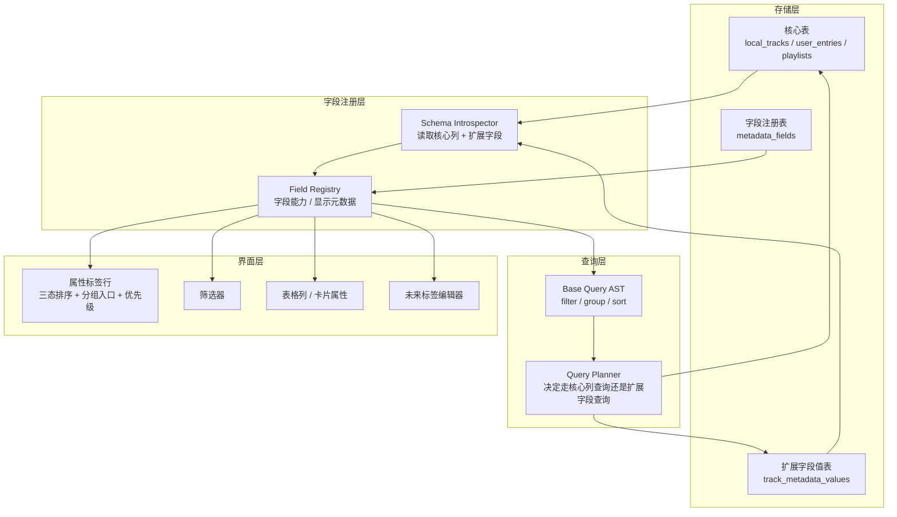

# 音乐库动态字段与分组排序基座升级方案

> 适用范围：`PMP` 当前音乐库模块，以及后续计划中的类似 `musictag` 的标签编辑器模块。  
> 文档目标：评估当前实现，明确问题边界，并给出一套“先兼容现状、再逐步解耦扩展”的底层方案。

## 1. 当前实现评估

### 1.1 当前基座的优点

- 已经有一套较完整的 Base Query 状态模型：过滤、排序、分组、视图属性都能持久化。
- 已经存在前后端两层查询路径：
  - Web / 回退路径：前端 `IndexedDB` + 内存过滤排序。
  - Native 路径：Rust `SQLite` 查询 + 前端渲染。
- 现有 UI 已经具备“属性标签行”和“排序面板”两种入口，适合升级为统一的字段管理入口。

### 1.2 当前基座的核心问题

#### 问题 A：字段是硬编码的，不是“从数据库结构派生”

目前字段能力分散在多个地方，各自维护一份固定字段列表：

- `apps/desktop/src/modules/music-library/baseQuery.ts`
  - `MusicLibraryBaseField`
  - `NATIVE_FILTER_FIELDS`
  - `NATIVE_SORT_FIELDS`
- `apps/desktop/src/modules/music-library/baseMeta.ts`
  - 字段标签
  - 可过滤字段列表
  - 可分组字段列表
  - 可排序字段列表
- `apps/desktop/src/modules/music-library/localTrackColumns.ts`
  - 表格列定义
  - 列宽、默认显示、排序映射
- `apps/desktop/src/modules/music-library/groupedRows.ts`
  - 分组值解析
  - 分组标题构建
- `apps/desktop/src/services/audio/MusicLibraryService.ts`
  - Base 字段到 Native 查询字段的映射
- `apps/desktop/src/modules/music-library/nativeLibraryDb.ts`
  - Native 查询支持的 filter/sort/group 字段白名单
- `apps/desktop/src-tauri/src/music_library_db.rs`
  - SQLite 查询 SQL 中真正支持的列映射

这意味着：

- 新增一个字段，不是“加一列”那么简单，而是要改 5 到 7 个位置。
- 字段一旦未来允许用户自定义，就会立即遇到结构性瓶颈。
- 字段能力和 UI 表现强耦合，不利于后续做标签编辑器、字段扩展、连接器平台字段接入。

#### 问题 B：当前 group by 语义不完整

从数据库语义看，`group` 和 `sort` 相关，但不是一回事：

- `sort` 的职责是定义顺序。
- `group` 的职责是定义显示边界 / 分区边界。

当前实现中：

- Native 查询层会把 `groupBy` 与 `sort` 都合并进 `ORDER BY`。
- 真正的“分组头”是在前端根据连续相同字段值临时切出来的。

这类实现可以做“视觉分组”，但它本质上仍然是：

- 先排序；
- 再由 UI 根据相邻记录是否变化插入分组头。

这对表格 UI 是成立的，但还不够完整，因为它缺少：

- 字段能力层面的“哪些字段允许分组”；
- 分组值的标准化规则；
- “未分组 / 空值 / 多值字段”如何归类；
- 分组与排序优先级的统一建模；
- 后续用户新增字段后自动进入分组能力列表的机制。

#### 问题 C：字段能力没有独立建模

目前一个字段是否能：

- 排序
- 分组
- 过滤
- 显示成列
- 作为标签编辑目标

这些能力是散落在不同文件里的，而不是一个统一的字段注册表来声明。

结果就是：

- 一个字段可以显示，但不一定能排序；
- 一个字段能在某处排序，但另一处又不能过滤；
- “字段是什么”与“字段能干什么”没有被统一表达。

#### 问题 D：无法优雅支持“用户新增字段”

如果未来用户在音乐库里新增一个字段，例如：

- `edition`
- `catalogNumber`
- `mediaType`
- `mood`
- `bpm`

当前系统不能仅通过数据库结构感知它，也不能自然地让它进入：

- 属性标签行
- 分组菜单
- 排序菜单
- 过滤器
- 表格列
- 标签编辑器

这说明当前基座还没有形成真正的“字段驱动设计”。

## 2. 设计目标

### 2.1 目标

新的基座应当满足：

1. **字段单一真源**
   - 字段定义不再散落在多处，而是统一从字段注册表获取。
2. **数据库结构可感知**
   - 系统能够根据实际数据库结构、扩展表、派生字段自动生成字段清单。
3. **能力声明化**
   - 每个字段的排序、分组、过滤、显示、编辑能力由元数据声明，而不是靠多个 `switch` 分散维护。
4. **兼容现有音乐库实现**
   - 第一阶段不强制重写全部扫描 / 播放 / 歌词 / 播放列表逻辑。
5. **支持未来标签编辑器**
   - 后续 `musictag` 模块可直接复用字段注册表与写入管线。
6. **支持用户新增字段**
   - 用户后续新增字段后，可以自然进入筛选、排序、分组、显示入口。

### 2.2 非目标

当前阶段不建议：

- 直接把所有核心字段改成 EAV（Entity-Attribute-Value）存储；
- 直接放弃现有 `local_tracks` / `user_entries` 核心表；
- 一次性重写音乐库所有查询命令与 UI。

更合理的路线是：

- 保留核心列式表；
- 增加“字段注册表 + 扩展字段值表”；
- 先把字段读取、能力判断、UI 入口统一；
- 再逐步把用户自定义字段纳入查询与编辑。

## 3. 推荐方案：核心字段表 + 字段注册表 + 扩展字段值表

### 3.1 推荐的总体结构



### 3.2 三层字段模型

#### 第一层：核心字段 Core Fields

这类字段直接映射到当前主表列，例如：

- `title`
- `artist`
- `album`
- `genre`
- `duration`
- `playCount`
- `fileSize`
- `sampleRate`
- `bitDepth`
- `status`

特点：

- 查询性能最好；
- 可以直接利用 SQLite 索引；
- 仍然是音乐库最核心的主干字段。

#### 第二层：派生字段 Derived Fields

这类字段不一定直接存一列，但可以稳定推导，例如：

- `format`
- `extension`
- `folder`
- `yearBucket`
- `hasLyrics`
- `isMissing`

特点：

- 可以由核心字段计算；
- 可以在字段注册表中声明为“可分组 / 可过滤 / 可排序”；
- 不一定需要落地存储。

#### 第三层：扩展字段 Extension Fields

这类字段为未来用户自定义或连接器注入字段，例如：

- `catalogNumber`
- `mediaType`
- `edition`
- `mood`
- `bpm`
- `label`

特点：

- 不适合继续硬编码进 `Track` 基础类型；
- 更适合用扩展字段值表存储；
- 最适合未来 `musictag` 编辑器读写。

## 4. 建议新增的底层数据结构

### 4.1 字段注册表：`metadata_fields`

建议新增一张“字段注册表”，作为所有字段能力的统一真源。

建议字段如下：

| 列名 | 类型 | 说明 |
| --- | --- | --- |
| `field_key` | `TEXT PRIMARY KEY` | 稳定字段键，例如 `artist`、`bpm` |
| `scope` | `TEXT` | 作用对象，如 `track` / `entry` / `playlist` |
| `source_kind` | `TEXT` | `core` / `derived` / `user` / `connector` |
| `storage_kind` | `TEXT` | `column` / `derived` / `kv` / `json` |
| `value_type` | `TEXT` | `text` / `number` / `integer` / `boolean` / `date` |
| `label` | `TEXT` | UI 显示名称 |
| `description` | `TEXT` | 字段说明 |
| `source_table` | `TEXT` | 来源表，如 `local_tracks` |
| `source_column` | `TEXT` | 来源列，如 `artist` |
| `sortable` | `INTEGER` | 是否可排序 |
| `groupable` | `INTEGER` | 是否可分组 |
| `filterable` | `INTEGER` | 是否可过滤 |
| `editable` | `INTEGER` | 是否可编辑 |
| `multi_value` | `INTEGER` | 是否多值 |
| `facetable` | `INTEGER` | 是否可做 facet / 分组选项 |
| `default_visible` | `INTEGER` | 是否默认显示 |
| `default_order_weight` | `INTEGER` | 默认排序/展示优先级 |
| `formatter_json` | `TEXT` | 格式化规则 |
| `created_at_ms` | `INTEGER` | 创建时间 |
| `updated_at_ms` | `INTEGER` | 更新时间 |

这张表的价值是：

- UI 不再问“这个字段在不在某个硬编码数组里”；
- UI 只要问字段注册表：它能不能排、能不能分、能不能滤、要怎么显示；
- 后续新增字段，只要插入一条字段定义，就能被发现。

### 4.2 扩展字段值表：`track_metadata_values`

为支持未来用户新增字段，建议新增扩展字段值表。

建议字段如下：

| 列名 | 类型 | 说明 |
| --- | --- | --- |
| `track_id` | `TEXT` | 关联 `local_tracks.id` |
| `field_key` | `TEXT` | 关联 `metadata_fields.field_key` |
| `ordinal` | `INTEGER` | 多值字段顺序，默认 `0` |
| `value_text` | `TEXT` | 文本值 |
| `value_number` | `REAL` | 数值值 |
| `value_integer` | `INTEGER` | 整数值 |
| `value_bool` | `INTEGER` | 布尔值 |
| `value_sort_text` | `TEXT` | 归一化后的排序值 |
| `value_sort_number` | `REAL` | 数值排序值 |
| `value_json` | `TEXT` | 复杂值 / 结构化值 |
| `source` | `TEXT` | `scan` / `user` / `connector` |
| `updated_at_ms` | `INTEGER` | 更新时间 |

建议主键与索引：

- 主键：`PRIMARY KEY (track_id, field_key, ordinal)`
- 索引：
  - `(field_key)`
  - `(field_key, value_sort_text)`
  - `(field_key, value_sort_number)`
  - `(track_id)`

这样做的意义：

- 核心字段继续走高性能主表；
- 扩展字段单独存储；
- 后续做自定义字段、连接器字段、编辑器写回，都有稳定落点。

## 5. 查询与 UI 的新基座

### 5.1 用统一的字段描述对象替代多处硬编码

建议把现在的：

- `MusicLibraryBaseField`
- `MUSIC_LIBRARY_BASE_FILTER_FIELDS`
- `MUSIC_LIBRARY_BASE_GROUP_RULE_FIELDS`
- `MUSIC_LIBRARY_BASE_ORDER_RULE_FIELDS`
- `LOCAL_TRACK_COLUMN_DEFINITIONS`

逐步收敛成一个统一的字段描述结构，例如：

```ts
type LibraryFieldDefinition = {
  key: string;
  label: string;
  valueType: 'text' | 'number' | 'integer' | 'boolean' | 'date';
  sourceKind: 'core' | 'derived' | 'user' | 'connector';
  storageKind: 'column' | 'derived' | 'kv' | 'json';
  capabilities: {
    sortable: boolean;
    groupable: boolean;
    filterable: boolean;
    visible: boolean;
    editable: boolean;
  };
  native?: {
    filterField?: string;
    sortField?: string;
    groupField?: string;
  };
  column?: {
    defaultWidthPx?: number;
    minWidthPx?: number;
    maxWidthPx?: number;
    align?: 'left' | 'right' | 'center';
  };
};
```

第一阶段这个定义甚至可以先由当前硬编码字段生成；
第二阶段再改为由数据库注册表 + 派生字段生成。

### 5.2 排序与分组应分开建模

建议统一为：

- `groupRules`: 定义显示边界
- `sortRules`: 定义组内顺序与全局顺序

其关系应该是：

1. 先确定分组字段；
2. 查询层保证分组字段优先排序；
3. 组内再应用显式排序字段；
4. 最后使用稳定兜底键，例如 `id`。

也就是说：

- `group` 不是 `sort` 的别名；
- 但 `group` 需要借助排序才能稳定呈现分组边界。

### 5.3 属性标签行的建议交互

每个属性标签建议具备：

- **默认态**：不参与排序 / 分组
- **升序态**：参与排序，方向为 `asc`
- **降序态**：参与排序，方向为 `desc`
- **优先级标记**：显示 `1`、`2`、`3`…
- **次级菜单**：
  - 设为分组字段
  - 从排序中移除
  - 置顶优先级
  - 仅显示为列

一个合理的交互模型是：

```mermaid
stateDiagram-v2
  [*] --> default
  default --> asc: 点击标签
  asc --> desc: 再次点击
  desc --> default: 第三次点击
```

而“是否作为分组字段”建议不要和单击三态绑死，应该放在：

- 右键菜单；
- 长按菜单；
- 或排序管理入口里。

这样能避免“排序状态”和“分组状态”相互污染。

### 5.4 排序管理入口仍然保留

你前面提到“现在的排序按钮可以作为更好的管理入口”，这是正确的。

建议最终形成双入口：

- **轻量入口：属性标签行**
  - 快速切换排序三态
  - 快速设置优先级
- **专业入口：排序 / 分组管理面板**
  - 查看完整规则链
  - 调整优先级
  - 切换字段能力
  - 管理多级分组

这样既满足高频操作，也满足复杂配置。

## 6. 推荐的落地路线

### Phase 1：统一字段注册层，不改数据库结构

目标：先把“字段定义”统一起来。

做法：

- 新增 `libraryFieldRegistry` 模块；
- 由它统一产出：
  - 字段标签
  - 可分组字段
  - 可排序字段
  - 可过滤字段
  - 列定义
- 让 `baseMeta.ts`、`localTrackColumns.ts`、`MusicLibraryService.ts` 改为消费 registry。

收益：

- 先解决多处硬编码复制问题；
- 不需要立刻改数据库。

### Phase 2：引入数据库结构感知

目标：让字段清单尽可能来自数据库。

做法：

- Native 侧增加 schema introspection 能力；
- 读取：
  - `local_tracks` 列
  - `user_entries` 列
  - `metadata_fields`（如果已存在）
- 前端统一调用 `listLibraryFields()` 之类接口获取字段目录。

收益：

- “字段清单”不再完全依赖前端类型硬编码；
- 为未来字段扩展打下基础。

### Phase 3：增加扩展字段值表

目标：真正支持用户新增字段。

做法：

- 新增 `metadata_fields` 与 `track_metadata_values`；
- 新字段进入字段注册表后：
  - 自动进入筛选入口
  - 自动进入分组入口
  - 自动进入属性标签候选区

收益：

- 真正形成“字段驱动”的音乐库；
- 为标签编辑器提供统一底座。

### Phase 4：让编辑器与音乐库共用同一套字段基座

目标：后续 `musictag` 模块直接复用。

做法：

- 编辑器读取字段注册表；
- 编辑器写回核心列或扩展字段值表；
- 音乐库列表与编辑器使用同一字段定义、同一格式化规则、同一能力模型。

收益：

- 避免音乐库与编辑器各做一套字段系统；
- 降低未来维护成本。

## 7. 对当前实现的结论

### 结论 1

当前这套排序 / 分组升级，已经把 UI 方向走对了，但底层仍然偏“功能拼接”，还没有进入真正的“字段驱动基座”。

### 结论 2

如果只是为了当前音乐库“够用”，现在的基座还能继续迭代；但如果你明确希望后续支持：

- 用户新增字段；
- 字段自动出现在筛选 / 分组 / 排序；
- 做类似 `musictag` 的标签编辑器；

那么现在就应该开始把底层往“字段注册表 + 扩展字段值表”方向收敛。

### 结论 3

最合理的路径不是重构一切，而是：

- **先统一字段注册层；**
- **再接入数据库结构感知；**
- **最后补扩展字段存储。**

这个路线风险最低、兼容最好，也最符合你说的“不是重构，而是升级”。

## 8. 建议的下一步实现顺序

如果按工程优先级推进，建议顺序如下：

1. **先做 `libraryFieldRegistry`**
   - 让现有硬编码字段从一个地方产出。
2. **再做 Native `listLibraryFields()`**
   - 让前端字段目录能读取数据库结构。
3. **把属性标签行完全接到 registry**
   - 标签不再手写字段集合。
4. **再设计 `metadata_fields` / `track_metadata_values` 迁移**
   - 真正支持扩展字段。
5. **最后给未来标签编辑器复用这套字段层**
   - 避免二次设计。

---

如果你愿意，下一步我可以继续把这份方案再细化成一份**可执行开发任务拆解清单**，按：

- 前端模块改造点
- Rust / SQLite 改造点
- 数据迁移步骤
- 风险与回滚策略

直接列成可实施 TODO。
