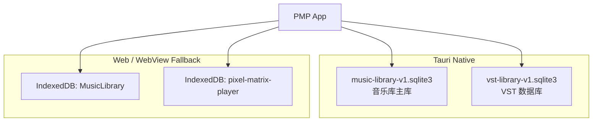
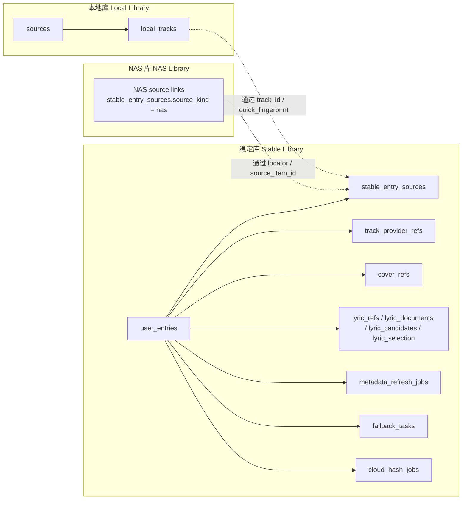
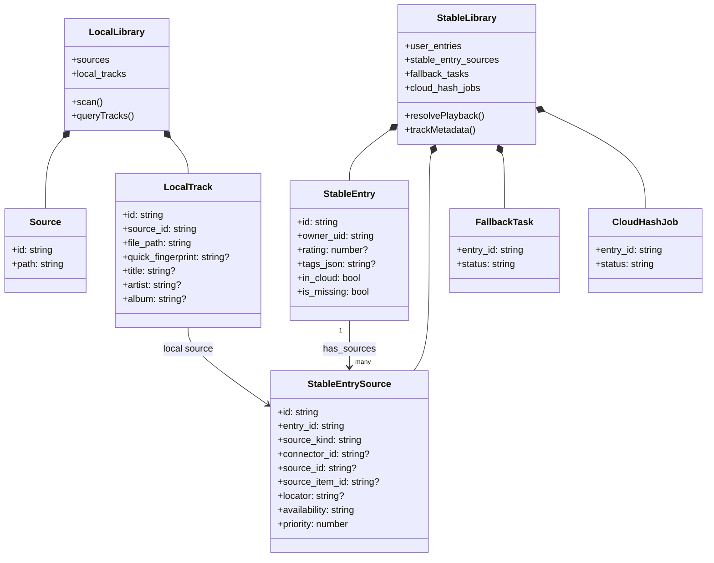
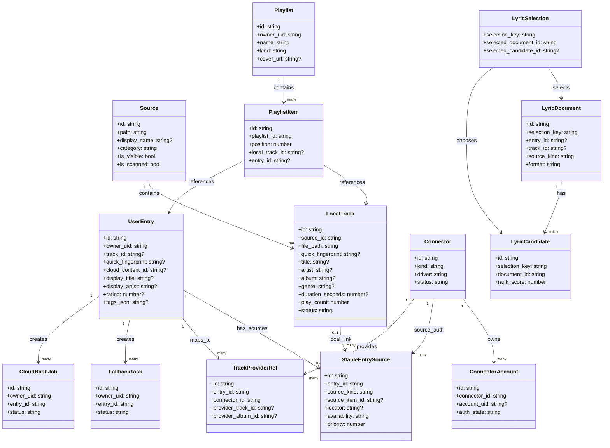
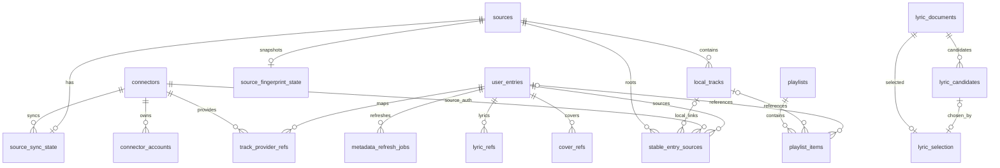
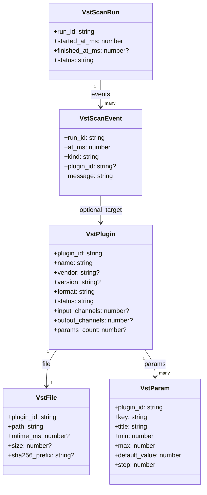
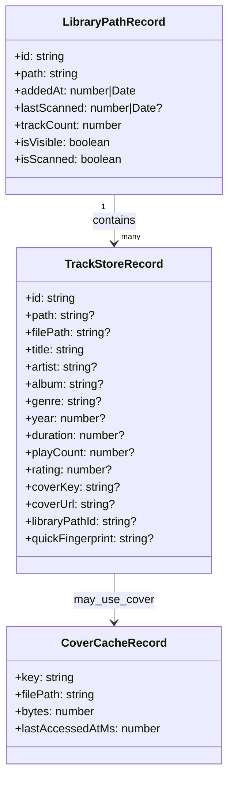
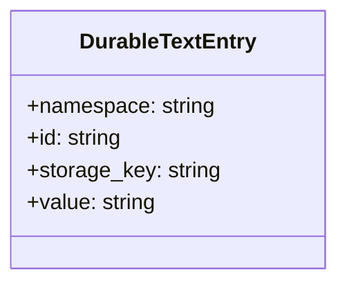

# PMP 数据库与存储架构手册

> 文档目标：把 PMP 当前实际使用的数据库、对象仓库、表结构、迁移来源和扩展规则整理成一份**可长期维护**的手册。  
> 文档范围：仅覆盖当前仓库里**真实存在并被代码使用**的数据库 / 对象仓库；普通 JSON 文件、缓存目录、媒体目录放在文末“非数据库持久化存储”中说明。  
> 适用读者：音乐库、标签编辑器、VST、平台连接器、前端回退存储相关开发者。

---

## 1. 维护说明

### 1.1 这份文档怎么维护

这份文档按“**数据库 -> 模块 -> 表 / Store**”组织，新增能力时按下面规则更新：

- 新增数据库：更新“数据库总览”“存储拓扑图”，并新增一个同层章节。
- 新增表 / Object Store：更新对应数据库的“结构目录”“类图 / 关系图”“明细表”。
- 新增字段 / 索引：更新对应表的小节，不要只改代码不改文档。
- 新增迁移版本：更新“版本演进”小节。
- 新增扩展方案但尚未落地：放到“扩展建议”中，和当前已实现结构严格区分。

### 1.2 维护时的真源文件

数据库结构的**代码真源**如下：

| 数据库 | 真源文件 |
| --- | --- |
| 音乐库 SQLite | `apps/desktop/src-tauri/src/music_library_db.rs` |
| VST SQLite | `apps/desktop/src-tauri/src/vst_library.rs` |
| 音乐库 IndexedDB | `apps/desktop/src/services/audio/MusicLibraryService.ts` |
| durableText IndexedDB | `apps/desktop/src/modules/storage/durableTextStore.ts` |

### 1.3 推荐更新流程

每次数据库相关改动，建议按这个顺序做：

1. 改 schema / migration 代码。
2. 改对应查询 / DTO / TS 类型。
3. 更新本手册中的：
   - 总览矩阵
   - 版本演进
   - 表结构 / Store 结构
   - 类图 / 关系图
4. 如涉及字段系统，再同步更新 `music-library-field-architecture-plan.md`。

---

## 2. 数据库总览

### 2.1 存储清单

| 名称 | 类型 | 运行侧 | 路径 / 名称 | 当前版本 | 用途 |
| --- | --- | --- | --- | --- | --- |
| `music-library-v1.sqlite3` | SQLite | Tauri Native | `<AppData>/music-library/music-library-v1.sqlite3` | `11` | 音乐库主数据库 |
| `vst-library-v1.sqlite3` | SQLite | Tauri Native | `<AppData>/audio/vst-library-v1.sqlite3` | `3` | VST 插件索引与扫描历史 |
| `MusicLibrary` | IndexedDB | 浏览器 / WebView | `indexedDB["MusicLibrary"]` | `5` | 音乐库前端回退存储 |
| `pixel-matrix-player` | IndexedDB | 浏览器 / WebView | `indexedDB["pixel-matrix-player"]` | `1` | durable text 文本持久化 |

### 2.2 存储拓扑图

### 2.3 职责边界

- `music-library-v1.sqlite3`
  - 当前最核心的音乐库真源。
  - 承载本地音轨、稳定条目、稳定条目的多来源链接、连接器、歌词、播放列表、云回退任务。
- `vst-library-v1.sqlite3`
  - 面向音频插件扫描与索引。
  - 与音乐库域完全分开。
- `MusicLibrary` IndexedDB
  - 前端回退层，不是 Native 场景下的主真源。
  - 也承担一部分旧数据兼容和封面缓存索引职责。
- `pixel-matrix-player` IndexedDB
  - 通用文本存储层，和音乐库主数据无直接结构耦合。

---

## 3. 音乐库主数据库：`music-library-v1.sqlite3`

### 3.0 先说结论：它是“一个物理库，三个音乐库入口”

你说的这个记忆是对的。  
当前 PMP 的音乐库在**逻辑设计**上，确实可以分成：

- **本地库（Local Library）**
- **NAS 库（NAS Library）**
- **稳定库（Stable Library）**

但在**物理落地**上，它们目前并不是两个独立 SQLite 文件，而是共同落在同一个数据库文件：

- `music-library-v1.sqlite3`

所以这份手册里需要同时区分两层含义：

1. **物理数据库层**：实际只有一个音乐库主库文件。
2. **逻辑入口层**：UI 上有本地库、NAS 库、稳定库三个入口。
3. **领域模型层**：主库内部以本地资源、稳定条目、稳定条目的多来源链接作为核心结构。

### 3.0.1 逻辑分层总览

| 逻辑库 | 核心目标 | 核心实体 | 典型特征 |
| --- | --- | --- | --- |
| 本地库 | 描述“本机磁盘上真实存在的音频文件” | `sources`、`local_tracks` | 面向扫描、文件路径、元数据、可播放本地资源 |
| NAS 库 | 描述“局域网 / NAS 服务中的远程音频资源” | 当前先作为 UI 入口与 `stable_entry_sources.source_kind = 'nas'` 的预留来源 | 面向远程服务、可迁移 locator、可用性检测；专门的 NAS 扫描表尚未落地 |
| 稳定库 | 描述“用户视角下稳定存在的音乐条目” | `user_entries`、`stable_entry_sources` | `user_entries` 保持稳定身份；`stable_entry_sources` 记录本地 / NAS / 平台 / 缓存 / PMP 服务器来源 |

### 3.0.2 音乐库入口关系图

### 3.0.3 音乐库入口类图

### 3.0.4 为什么叫“稳定库”

从当前实现看，稳定库的关键不是“文件稳定存在”，而是“**用户条目身份稳定**”。

也就是说：

- 一个本地文件可能被移动、重扫、临时缺失。
- 但用户视角下的条目仍然可以保留：
  - 条目 ID
  - 所属用户
  - 显示标题 / 艺术家
  - 标签
  - 评分
  - 缺失状态
  - 多个可替换音源链接
  - 回退任务

所以稳定库更像是：

- **用户音乐身份层**
- **来源解析与桥接层**
- **条目持久层**

而本地库更像是：

- **文件资源层**
- **扫描索引层**
- **本地播放素材层**

### 3.1 基本信息

- 类型：SQLite
- 路径：`<AppData>/music-library/music-library-v1.sqlite3`
- 当前 schema version：`11`
- 代码真源：`apps/desktop/src-tauri/src/music_library_db.rs`
- 初始化 PRAGMA：
  - `PRAGMA foreign_keys = ON`
  - `PRAGMA journal_mode = WAL`
  - `PRAGMA synchronous = NORMAL`

### 3.2 版本演进

| 版本 | 变化 |
| --- | --- |
| `v1` | 早期基础结构 |
| `v2` | 为 `local_tracks` 增加 `genre` |
| `v3` | 为 `local_tracks` 增加 `play_count`、`last_played_at_ms` |
| `v4` | 建立 `sources`、`local_tracks`、`user_entries`、`fallback_tasks`、`cloud_hash_jobs` 当前基础主干 |
| `v5` | 增加连接器与同步相关表：`connectors`、`connector_accounts`、`source_sync_state`、`source_fingerprint_state`、`track_provider_refs`、`cover_refs`、`lyric_refs`、`metadata_refresh_jobs` |
| `v6` | 增加歌词流水线表：`lyric_documents`、`lyric_candidates`、`lyric_selection`、`lyric_fetch_jobs` |
| `v7` | 增加播放列表表：`playlists`、`playlist_items` |
| `v8` | `playlists` 增加 `cover_url` |
| `v9` | `local_tracks` 增加 `year`、`format` |
| `v10` | 增加平台实例授权表：`platform_instance_auth` |
| `v11` | 增加稳定条目多来源表：`stable_entry_sources` |

### 3.3 结构目录

| 域 | 表 |
| --- | --- |
| 核心音乐库 | `sources`、`local_tracks`、`user_entries`、`stable_entry_sources` |
| 连接器与同步 | `connectors`、`connector_accounts`、`source_sync_state`、`source_fingerprint_state` |
| 云端映射与元数据引用 | `track_provider_refs`、`cover_refs`、`lyric_refs`、`metadata_refresh_jobs` |
| 歌词流水线 | `lyric_documents`、`lyric_candidates`、`lyric_selection`、`lyric_fetch_jobs` |
| 播放列表 | `playlists`、`playlist_items` |
| 云回退与哈希任务 | `fallback_tasks`、`cloud_hash_jobs` |

### 3.3.1 按“本地库 / NAS 库 / 稳定库”重排后的结构目录

| 逻辑库 | 主表 | 辅助表 |
| --- | --- | --- |
| 本地库 `Local Library` | `sources`、`local_tracks` | `source_sync_state`、`source_fingerprint_state` |
| NAS 库 `NAS Library` | 暂无独立主表 | 当前通过 `stable_entry_sources.source_kind = 'nas'` 预留来源链接 |
| 稳定库 `Stable Library` | `user_entries` | `stable_entry_sources`、`track_provider_refs`、`cover_refs`、`lyric_refs`、`metadata_refresh_jobs`、`fallback_tasks`、`cloud_hash_jobs` |
| 共享能力域 | `playlists`、`playlist_items`、`lyric_documents`、`lyric_candidates`、`lyric_selection`、`lyric_fetch_jobs` | 由本地库、NAS 库与稳定库共同引用 |

### 3.3.2 当前代码中的“稳定库”落点

当前稳定库在代码里的落点是明确存在的，不只是概念：

- UI 源切换：`apps/desktop/src/components/pages/MusicLibrary.tsx`
- 稳定库统计模型：`apps/desktop/src/modules/music-library/stableLibraryModel.ts`
- 稳定库列表服务：`apps/desktop/src/services/audio/MusicLibraryService.ts`
- 稳定库底层实体 / TS 桥接：`apps/desktop/src/modules/music-library/nativeLibraryDb.ts`
- 稳定条目来源链接：`apps/desktop/src-tauri/src/music_library_db.rs` 的 `stable_entry_sources`

因此更准确的说法应该是：

- **有本地库，也有稳定库；**
- **现在 UI 还会出现 NAS 库入口；**
- **但它们当前共享一个物理 SQLite 主库，并通过来源链接区分本地 / NAS / 平台 / 缓存。**

### 3.3.3 本地库字段矩阵

> 这张表回答的是：**本地库今天到底有哪些字段，分别落在哪一层。**  
> 重点不是列出 `Track` 的所有可能属性，而是区分“已进 Native 主库”和“目前只在前端 / 回退层存在”的字段。

| 语义字段 | 本地库 UI | 前端 `Track` | Native `NativeLibraryTrackRecord` | SQLite | 说明 |
| --- | --- | --- | --- | --- | --- |
| 轨道 ID | 间接使用 | `id` | `id` | `local_tracks.id` | 主键 |
| 来源 ID | 间接使用 | `libraryPathId` | `sourceId` | `local_tracks.source_id` | 指向 `sources.id` |
| 文件路径 | 不直接展示为主列 | `path` / `filePath` | `filePath` | `local_tracks.file_path` | 本地资源定位核心字段 |
| 快速指纹 | 不直接展示 | `quickFingerprint` | `quickFingerprint` | `local_tracks.quick_fingerprint` | 本地库 / 稳定库桥接关键字段 |
| 标题 | 是 | `title` | `title` | `local_tracks.title` | 本地库主显示字段 |
| 艺术家 | 是 | `artist` | `artist` | `local_tracks.artist` | 本地库主显示字段 |
| 专辑 | 是 | `album` | `album` | `local_tracks.album` | 本地库主显示字段 |
| 流派 | 是 | `genre` | `genre` | `local_tracks.genre` | 已进 Native 主库 |
| 时长 | 是 | `duration` | `durationSeconds` | `local_tracks.duration_seconds` | 已进 Native 主库 |
| 采样率 | 是 | `sampleRate` | `sampleRate` | `local_tracks.sample_rate` | 已进 Native 主库 |
| 位深 | 间接使用 / 未默认展示 | `bitDepth` | `bitDepth` | `local_tracks.bit_depth` | 已进 Native 主库 |
| 文件大小 | 是 | `fileSize` | `fileSize` | `local_tracks.file_size` | 已进 Native 主库 |
| 文件修改时间 | 不直接展示 | `mtimeMs` | `mtimeMs` | `local_tracks.mtime_ms` | 扫描变更检测字段 |
| ReplayGain Track | 不直接展示 | `replayGainTrackGainDb` | `replayGainTrackDb` | `local_tracks.replay_gain_track_db` | 音频处理相关 |
| ReplayGain Album | 不直接展示 | `replayGainAlbumGainDb` | `replayGainAlbumDb` | `local_tracks.replay_gain_album_db` | 音频处理相关 |
| 播放次数 | 是 | `playCount` | `playCount` | `local_tracks.play_count` | 已进 Native 主库 |
| 上次播放 | 是 | `lastPlayed` | `lastPlayedAtMs` | `local_tracks.last_played_at_ms` | 已进 Native 主库 |
| 状态 | 间接使用 | 无统一显式字段 | `status` | `local_tracks.status` | 如 `available` / `missing` |
| 创建时间 | 不直接展示 | 无稳定对齐字段 | 无 | `local_tracks.created_at_ms` | Native 内部时间字段 |
| 更新时间 | 间接使用 | `metadataScannedAtMs` / `addedAt`（映射语义） | `updatedAtMs` | `local_tracks.updated_at_ms` | 也是当前 Native 回传的新增时间近似来源 |
| 最近看见时间 | 不直接展示 | 无 | 无 | `local_tracks.last_seen_at_ms` | 扫描完整性字段 |
| 年份 | 是 | `year` | 无 | 无 | 当前未进入 Native 主库，更多来自前端 / 回退层 |
| 曲号 | 是 | `trackNumber` | 无 | 无 | 当前未进入 Native 主库 |
| 碟号 | 是 | `discNumber` | 无 | 无 | 当前未进入 Native 主库 |
| 作曲 | 是 | `composer` | 无 | 无 | 当前未进入 Native 主库 |
| 比特率 | 是 | `bitrate` | 无 | 无 | 当前未进入 Native 主库 |
| 格式 | 是 | `format` / `codecName` | 无 | 无 | 当前未进入 Native 主库 |
| 评分 | 是 | `rating` | 无 | 无 | 本地库视图可展示，但 Native 主库未存 |
| 添加日期 | 是 | `dateAdded` / `addedAt` | 无直接列 | 无 | 当前更多是前端映射语义，不是独立 SQLite 列 |
| 封面 | 间接使用 | `coverKey` / `coverUrl` | 无直接列 | 无 | 本地库主表不直接存封面字段 |

### 3.3.4 稳定库字段矩阵

> 稳定库以“用户条目身份”而不是“文件资源”作为中心。  
> `user_entries.track_id`、`quick_fingerprint`、`cloud_content_id` 仍是兼容字段；新的来源结构应优先落到 `stable_entry_sources`。

| 语义字段 | 稳定库 UI | `NativeLibraryUserEntryRecord` | SQLite | 说明 |
| --- | --- | --- | --- | --- |
| 条目 ID | 间接使用 | `id` | `user_entries.id` | 稳定条目主键 |
| 所属用户 | 是 | `ownerUid` | `user_entries.owner_uid` | 稳定库主视图直接显示 |
| 关联本地音轨 ID | 不直接展示 | `trackId` | `user_entries.track_id` / `stable_entry_sources.track_id` | `user_entries` 中为兼容字段；新来源记录优先写 `stable_entry_sources` |
| 快速指纹 | 不直接展示 | `quickFingerprint` | `user_entries.quick_fingerprint` / `stable_entry_sources.quick_fingerprint` | 本地 / 稳定桥接关键字段 |
| 云内容 ID | 不直接展示 | `cloudContentId` | `user_entries.cloud_content_id` / `stable_entry_sources.locator` | `user_entries` 中为兼容字段；平台 URI 应进入来源链接 |
| 来源类型 | 不直接展示 | `sourceKind` | `stable_entry_sources.source_kind` | `local` / `nas` / `platform` / `cache` / `pmp-server` |
| 来源定位 | 不直接展示 | `locator` | `stable_entry_sources.locator` | 本地路径、NAS URI、平台 URI、缓存路径等 |
| 来源可用性 | 间接显示为状态 | `availability` | `stable_entry_sources.availability` | `available` / `missing` / `remote-only` / `stale` / `auth-required` / `unknown` |
| 来源优先级 | 后续解析使用 | `priority` | `stable_entry_sources.priority` | 多来源同时存在时决定优先解析顺序 |
| 显示标题 | 是 | `displayTitle` | `user_entries.display_title` | 稳定库主显示字段 |
| 显示艺术家 | 是 | `displayArtist` | `user_entries.display_artist` | 稳定库主显示字段 |
| 评分 | 在元数据编辑器中编辑 | `rating` | `user_entries.rating` | 稳定库当前可编辑字段之一 |
| 标签 JSON | 在元数据编辑器中编辑 | `tagsJson` | `user_entries.tags_json` | 稳定库当前可编辑字段之一 |
| 是否在云端 | 间接显示为状态 | `inCloud` | `user_entries.in_cloud` | 状态计算输入 |
| 是否缺失 | 间接显示为状态 | `isMissing` | `user_entries.is_missing` | 状态计算输入 |
| 播放次数 | 是 | `playCount` | `user_entries.play_count` | 稳定库主视图展示 |
| 上次播放 | 是 | `lastPlayedAtMs` | `user_entries.last_played_at_ms` | 稳定库主视图展示 |
| 创建时间 | 不直接展示 | `createdAtMs` | `user_entries.created_at_ms` | 条目生命周期字段 |
| 更新时间 | 是 | `updatedAtMs` | `user_entries.updated_at_ms` | 稳定库当前默认排序主键 |

### 3.3.5 UI 字段 ↔ TS 类型 ↔ Native 查询 ↔ SQLite 映射表

> 这张表是给后续做字段基座升级、标签编辑器、查询下推时用的。

#### 3.3.5.1 本地库 Base Query 字段映射

| Base/UI 字段 | UI 标签键 | 前端 `Track` 字段 | Native Query 字段 | SQLite 表达式 / 列 | 当前 Native 过滤 | 当前 Native 排序/分组 |
| --- | --- | --- | --- | --- | --- | --- |
| `title` | `pages.music-library.tracks.header.title` | `title` | `title` | `local_tracks.title` | 是 | 是 |
| `artist` | `pages.music-library.tracks.header.artist` | `artist` | `artist` | `local_tracks.artist` | 是 | 是 |
| `album` | `pages.music-library.tracks.header.album` | `album` | `album` | `local_tracks.album` | 是 | 是 |
| `genre` | `pages.music-library.columns.genre` | `genre` | `genre` | `local_tracks.genre` | 是 | 是 |
| `duration` | `pages.music-library.tracks.header.duration` | `duration` | `durationSeconds` | `local_tracks.duration_seconds` | 是 | 是 |
| `playCount` | `pages.music-library.columns.playCount` | `playCount` | `playCount` | `local_tracks.play_count` | 是 | 是 |
| `year` | `pages.music-library.columns.year` | `year` | 无 | 无 | 否 | 否 |
| `rating` | `pages.music-library.columns.rating` | `rating` | 无 | 无 | 否 | 否 |
| `format` | `pages.music-library.columns.format` | `format` / `codecName` | 无 | 无 | 否 | 否 |

维护备注：

- 当前 Base Query 的 Native 下推能力只覆盖一小部分字段。
- 这也是后续“动态字段基座”要优先解决的瓶颈之一。

#### 3.3.5.2 本地库表格列映射

| 本地库列 ID | UI 标签键 | 前端 `Track` 字段 | Native 主库是否落列 | SQLite 列 |
| --- | --- | --- | --- | --- |
| `title` | `pages.music-library.tracks.header.title` | `title` | 是 | `local_tracks.title` |
| `artist` | `pages.music-library.tracks.header.artist` | `artist` | 是 | `local_tracks.artist` |
| `album` | `pages.music-library.tracks.header.album` | `album` | 是 | `local_tracks.album` |
| `duration` | `pages.music-library.tracks.header.duration` | `duration` | 是 | `local_tracks.duration_seconds` |
| `year` | `pages.music-library.columns.year` | `year` | 否 | 无 |
| `genre` | `pages.music-library.columns.genre` | `genre` | 是 | `local_tracks.genre` |
| `trackNumber` | `pages.music-library.columns.trackNumber` | `trackNumber` | 否 | 无 |
| `discNumber` | `pages.music-library.columns.discNumber` | `discNumber` | 否 | 无 |
| `composer` | `pages.music-library.columns.composer` | `composer` | 否 | 无 |
| `bitrate` | `pages.music-library.columns.bitrate` | `bitrate` | 否 | 无 |
| `sampleRate` | `pages.music-library.columns.sampleRate` | `sampleRate` | 是 | `local_tracks.sample_rate` |
| `format` | `pages.music-library.columns.format` | `format` / `codecName` | 否 | 无 |
| `playCount` | `pages.music-library.columns.playCount` | `playCount` | 是 | `local_tracks.play_count` |
| `lastPlayed` | `pages.music-library.columns.lastPlayed` | `lastPlayed` | 是 | `local_tracks.last_played_at_ms` |
| `rating` | `pages.music-library.columns.rating` | `rating` | 否 | 无 |
| `fileSize` | `pages.music-library.columns.fileSize` | `fileSize` | 是 | `local_tracks.file_size` |
| `dateAdded` | `pages.music-library.columns.dateAdded` | `dateAdded` / `addedAt` | 否（当前无独立列） | 无 |

#### 3.3.5.3 稳定库字段映射

| 稳定库 UI 字段 | UI 标签键 | TS 字段 | SQLite 列 | 说明 |
| --- | --- | --- | --- | --- |
| 标题 | `pages.music-library.stable.header.title` | `displayTitle` | `user_entries.display_title` | 当前主显示字段 |
| 艺术家 | `pages.music-library.stable.header.artist` | `displayArtist` | `user_entries.display_artist` | 当前主显示字段 |
| 所有者 | `pages.music-library.stable.header.owner` | `ownerUid` | `user_entries.owner_uid` | 稳定库主索引字段 |
| 播放次数 | `pages.music-library.stable.header.playCount` | `playCount` | `user_entries.play_count` | 当前列表展示 |
| 上次播放 | `pages.music-library.stable.header.lastPlayed` | `lastPlayedAtMs` | `user_entries.last_played_at_ms` | 当前列表展示 |
| 更新时间 | `pages.music-library.stable.header.updatedAt` | `updatedAtMs` | `user_entries.updated_at_ms` | 当前默认排序字段 |
| 状态 | `pages.music-library.stable.header.status` | `isMissing` / `inCloud` | `user_entries.is_missing` / `user_entries.in_cloud` | UI 计算字段，不是单列直出 |
| 评分 | `pages.music-library.stable.metadata.rating` | `rating` | `user_entries.rating` | 当前编辑器支持 |
| 标签 | `pages.music-library.stable.metadata.tags` | `tagsJson` | `user_entries.tags_json` | 当前编辑器支持 |

### 3.3.6 当前字段层的完整性结论

从字段视角看，当前音乐库并不是“所有 UI 字段都已进入 Native 主库”。

更准确地说：

- **本地库核心播放与检索字段**已经有较好的 Native SQLite 承接。
- **本地库展示字段**仍有不少只存在于前端 `Track` 宽对象层。
- **稳定库字段**现在拆成 `user_entries` 的稳定身份层和 `stable_entry_sources` 的来源链接层，后续 resolver 应围绕这两层展开。

这也是为什么后续如果要做：

- 动态字段
- 用户自定义分组
- 标签编辑器
- 更彻底的 Native 查询下推

就不能只看现有表结构，还必须把字段注册层补起来。

### 3.3.7 稳定库的来源解析原则

稳定库不应该把“听过一个平台音源”直接等同于“用户有一个稳定条目”。新的落点是：

- `user_entries`：稳定身份、用户编辑属性、播放统计、缺失状态。
- `stable_entry_sources`：这个稳定条目有哪些可尝试音源。
- 平台播放 / 搜索：默认只作为临时播放或候选来源，不自动创建 `user_entries`。
- 本地 / NAS / 平台 / 缓存 / PMP 服务器同时存在时，resolver 应按 `availability`、`priority`、`confidence`、`last_verified_at_ms` 选择音源；文件移动或 NAS 断连时只更新来源可用性，不删除稳定条目。

### 3.4 核心类图

> 这张图不是逐列展开，而是帮助后续维护者理解“这个库到底分成哪些聚合”。

### 3.5 关系图

### 3.6 表明细

> 为了便于维护，所有表都按同样格式书写：**用途 / 主键 / 外键 / 核心列 / 索引**。

#### 3.6.1 `sources`

- 用途：音乐库来源目录表。
- 主键：`id`
- 外键：无

核心列：

| 列名 | 类型 | 说明 |
| --- | --- | --- |
| `id` | `TEXT PRIMARY KEY` | 来源 ID |
| `path` | `TEXT UNIQUE NOT NULL` | 来源路径 |
| `display_name` | `TEXT` | 显示名称 |
| `category` | `TEXT NOT NULL DEFAULT 'music'` | 来源类别 |
| `is_visible` | `INTEGER NOT NULL DEFAULT 1` | 是否可见 |
| `is_scanned` | `INTEGER NOT NULL DEFAULT 1` | 是否参与扫描 |
| `added_at_ms` | `INTEGER NOT NULL` | 添加时间 |
| `last_scanned_at_ms` | `INTEGER` | 上次扫描时间 |
| `updated_at_ms` | `INTEGER NOT NULL` | 更新时间 |

索引：

- `sources_is_visible_idx`
- `sources_is_scanned_idx`

#### 3.6.2 `local_tracks`

- 用途：本地音轨主表。
- 主键：`id`
- 外键：`source_id -> sources.id`
- 唯一约束：`UNIQUE(source_id, file_path)`

核心列：

| 列名 | 类型 | 说明 |
| --- | --- | --- |
| `id` | `TEXT PRIMARY KEY` | 音轨 ID |
| `source_id` | `TEXT NOT NULL` | 所属来源 |
| `file_path` | `TEXT NOT NULL` | 文件路径 |
| `quick_fingerprint` | `TEXT` | 快速指纹 |
| `title` | `TEXT` | 标题 |
| `artist` | `TEXT` | 艺术家 |
| `album` | `TEXT` | 专辑 |
| `genre` | `TEXT` | 流派 |
| `duration_seconds` | `REAL` | 时长 |
| `sample_rate` | `INTEGER` | 采样率 |
| `bit_depth` | `INTEGER` | 位深 |
| `file_size` | `INTEGER` | 文件大小 |
| `mtime_ms` | `INTEGER` | 文件修改时间 |
| `replay_gain_track_db` | `REAL` | Track ReplayGain |
| `replay_gain_album_db` | `REAL` | Album ReplayGain |
| `play_count` | `INTEGER NOT NULL DEFAULT 0` | 播放次数 |
| `last_played_at_ms` | `INTEGER` | 最近播放时间 |
| `status` | `TEXT NOT NULL DEFAULT 'available'` | 可用状态 |
| `created_at_ms` | `INTEGER NOT NULL` | 创建时间 |
| `updated_at_ms` | `INTEGER NOT NULL` | 更新时间 |
| `last_seen_at_ms` | `INTEGER NOT NULL` | 最近扫描看见时间 |

索引：

- `local_tracks_source_id_idx`
- `local_tracks_quick_fingerprint_idx`
- `local_tracks_status_idx`
- `local_tracks_artist_idx`
- `local_tracks_album_idx`
- `local_tracks_last_played_at_ms_idx`

维护备注：

- 这是后续“动态字段基座”最重要的核心表。
- 新增高频查询字段时，优先考虑是否需要单独索引，而不是一味扩宽前端回退逻辑。

#### 3.6.3 `user_entries`

- 用途：用户视角的云端 / 个性化条目表。
- 主键：`id`
- 外键：`track_id -> local_tracks.id`，`ON DELETE SET NULL`

核心列：

| 列名 | 类型 | 说明 |
| --- | --- | --- |
| `id` | `TEXT PRIMARY KEY` | 条目 ID |
| `owner_uid` | `TEXT NOT NULL` | 所属用户 |
| `track_id` | `TEXT` | 关联本地音轨 |
| `quick_fingerprint` | `TEXT` | 快速指纹 |
| `cloud_content_id` | `TEXT` | 云内容 ID |
| `display_title` | `TEXT` | 显示标题 |
| `display_artist` | `TEXT` | 显示艺术家 |
| `rating` | `INTEGER` | 评分 |
| `tags_json` | `TEXT` | 标签 JSON |
| `in_cloud` | `INTEGER NOT NULL DEFAULT 0` | 是否在云端 |
| `is_missing` | `INTEGER NOT NULL DEFAULT 0` | 是否缺失 |
| `play_count` | `INTEGER NOT NULL DEFAULT 0` | 播放次数 |
| `last_played_at_ms` | `INTEGER` | 最近播放时间 |
| `created_at_ms` | `INTEGER NOT NULL` | 创建时间 |
| `updated_at_ms` | `INTEGER NOT NULL` | 更新时间 |

索引：

- `user_entries_owner_uid_idx`
- `user_entries_track_id_idx`
- `user_entries_quick_fingerprint_idx`
- `user_entries_cloud_content_id_idx`
- `user_entries_last_played_at_ms_idx`

维护备注：

- `track_id`、`quick_fingerprint`、`cloud_content_id` 是兼容字段；新增来源定位不要继续扩宽这张表，优先写入 `stable_entry_sources`。
- 后续如果做类似 `musictag` 的用户层标签编辑，优先评估是写回 `user_entries` 还是新增扩展字段表，不要把所有新属性都硬塞进这张表。

#### 3.6.3.1 `stable_entry_sources`

- 用途：稳定条目的多来源链接表。
- 主键：`id`
- 外键：
  - `entry_id -> user_entries.id`，`ON DELETE CASCADE`
  - `connector_id -> connectors.id`，`ON DELETE SET NULL`
  - `source_id -> sources.id`，`ON DELETE SET NULL`
  - `track_id -> local_tracks.id`，`ON DELETE SET NULL`
- 约束：
  - `source_kind` 取值：`local`、`nas`、`platform`、`cache`、`pmp-server`
  - `availability` 取值：`available`、`missing`、`remote-only`、`stale`、`auth-required`、`unknown`

核心列：

| 列名 | 类型 | 说明 |
| --- | --- | --- |
| `id` | `TEXT PRIMARY KEY` | 来源链接 ID |
| `entry_id` | `TEXT NOT NULL` | 所属稳定条目 |
| `source_kind` | `TEXT NOT NULL` | 来源类型 |
| `connector_id` | `TEXT` | 平台 / NAS / 服务器连接器 |
| `source_id` | `TEXT` | 本地或远程来源根记录 |
| `source_item_id` | `TEXT` | 来源内部条目 ID |
| `locator` | `TEXT` | 路径、URI、缓存定位符 |
| `track_id` | `TEXT` | 本地音轨 ID |
| `quick_fingerprint` | `TEXT` | 快速指纹 |
| `full_fingerprint` | `TEXT` | 完整指纹 |
| `availability` | `TEXT NOT NULL DEFAULT 'unknown'` | 当前可用性 |
| `quality_score` | `REAL` | 质量评分，范围 `0..1` |
| `confidence` | `REAL NOT NULL DEFAULT 1.0` | 匹配置信度，范围 `0..1` |
| `priority` | `INTEGER NOT NULL DEFAULT 100` | resolver 优先级 |
| `last_verified_at_ms` | `INTEGER` | 最近验证时间 |
| `created_at_ms` | `INTEGER NOT NULL` | 创建时间 |
| `updated_at_ms` | `INTEGER NOT NULL` | 更新时间 |

索引：

- `stable_entry_sources_entry_id_idx`
- `stable_entry_sources_source_kind_idx`
- `stable_entry_sources_connector_id_idx`
- `stable_entry_sources_source_id_idx`
- `stable_entry_sources_source_item_id_idx`
- `stable_entry_sources_track_id_idx`
- `stable_entry_sources_quick_fingerprint_idx`
- `stable_entry_sources_availability_idx`
- `stable_entry_sources_priority_idx`

维护备注：

- 平台搜索和平台播放不应默认自动创建 `user_entries`；只有用户明确收藏 / 加入稳定库，或已经存在稳定条目时，才应写入来源链接。
- 文件移动、NAS 断连、平台授权过期时，优先更新 `availability`、`locator`、`last_verified_at_ms`，不要删除 `user_entries`。

#### 3.6.4 `connectors`

- 用途：平台连接器主表。
- 主键：`id`
- 外键：无

核心列：

| 列名 | 类型 | 说明 |
| --- | --- | --- |
| `id` | `TEXT PRIMARY KEY` | 连接器 ID |
| `kind` | `TEXT NOT NULL` | 类型 |
| `driver` | `TEXT NOT NULL` | 驱动 |
| `display_name` | `TEXT` | 显示名 |
| `status` | `TEXT NOT NULL DEFAULT 'active'` | 状态 |
| `created_at_ms` | `INTEGER NOT NULL` | 创建时间 |
| `updated_at_ms` | `INTEGER NOT NULL` | 更新时间 |

索引：

- `connectors_kind_idx`
- `connectors_status_idx`

#### 3.6.5 `connector_accounts`

- 用途：连接器账号表。
- 主键：`id`
- 外键：`connector_id -> connectors.id`，`ON DELETE CASCADE`

核心列：

| 列名 | 类型 | 说明 |
| --- | --- | --- |
| `id` | `TEXT PRIMARY KEY` | 账号记录 ID |
| `connector_id` | `TEXT NOT NULL` | 所属连接器 |
| `account_uid` | `TEXT` | 平台账号 UID |
| `auth_state` | `TEXT NOT NULL` | 授权状态 |
| `token_ref` | `TEXT` | Token 引用 |
| `refresh_token_ref` | `TEXT` | Refresh Token 引用 |
| `expires_at_ms` | `INTEGER` | 过期时间 |
| `created_at_ms` | `INTEGER NOT NULL` | 创建时间 |
| `updated_at_ms` | `INTEGER NOT NULL` | 更新时间 |

索引：

- `connector_accounts_connector_id_idx`
- `connector_accounts_auth_state_idx`

#### 3.6.6 `source_sync_state`

- 用途：来源同步状态表。
- 主键：`source_id`
- 外键：
  - `source_id -> sources.id`
  - `connector_id -> connectors.id`

核心列：

| 列名 | 类型 | 说明 |
| --- | --- | --- |
| `source_id` | `TEXT PRIMARY KEY` | 来源 ID |
| `connector_id` | `TEXT NOT NULL` | 连接器 ID |
| `sync_cursor` | `TEXT` | 同步游标 |
| `full_scan_at_ms` | `INTEGER` | 完整扫描时间 |
| `incremental_scan_at_ms` | `INTEGER` | 增量扫描时间 |
| `last_success_at_ms` | `INTEGER` | 最近成功时间 |
| `last_error` | `TEXT` | 最近错误 |
| `backoff_until_ms` | `INTEGER` | 退避截止时间 |
| `updated_at_ms` | `INTEGER NOT NULL` | 更新时间 |

索引：

- `source_sync_state_connector_id_idx`
- `source_sync_state_backoff_until_ms_idx`

#### 3.6.7 `source_fingerprint_state`

- 用途：来源目录树快照与指纹表。
- 主键：`source_id`
- 外键：`source_id -> sources.id`

核心列：

| 列名 | 类型 | 说明 |
| --- | --- | --- |
| `source_id` | `TEXT PRIMARY KEY` | 来源 ID |
| `tree_fingerprint` | `TEXT` | 树指纹 |
| `file_count` | `INTEGER NOT NULL DEFAULT 0` | 文件数 |
| `total_size` | `INTEGER NOT NULL DEFAULT 0` | 总大小 |
| `sampled_at_ms` | `INTEGER NOT NULL` | 采样时间 |
| `updated_at_ms` | `INTEGER NOT NULL` | 更新时间 |

索引：

- `source_fingerprint_state_sampled_at_ms_idx`

#### 3.6.8 `track_provider_refs`

- 用途：本地 / 用户条目与平台资源映射表。
- 主键：`id`
- 外键：
  - `entry_id -> user_entries.id`
  - `source_id -> sources.id`
  - `connector_id -> connectors.id`

核心列：

| 列名 | 类型 | 说明 |
| --- | --- | --- |
| `id` | `TEXT PRIMARY KEY` | 映射 ID |
| `entry_id` | `TEXT NOT NULL` | 用户条目 ID |
| `source_id` | `TEXT` | 来源 ID |
| `connector_id` | `TEXT NOT NULL` | 连接器 ID |
| `provider_track_id` | `TEXT` | 平台音轨 ID |
| `provider_album_id` | `TEXT` | 平台专辑 ID |
| `source_locator` | `TEXT` | 来源定位符 |
| `quality_tier` | `TEXT` | 质量等级 |
| `availability` | `TEXT NOT NULL DEFAULT 'unknown'` | 可用性 |
| `updated_at_ms` | `INTEGER NOT NULL` | 更新时间 |

索引：

- `track_provider_refs_entry_id_idx`
- `track_provider_refs_connector_id_idx`
- `track_provider_refs_provider_track_id_idx`
- `track_provider_refs_source_locator_idx`

#### 3.6.9 `cover_refs`

- 用途：封面引用表。
- 主键：`id`
- 外键：`entry_id -> user_entries.id`

核心列：

| 列名 | 类型 | 说明 |
| --- | --- | --- |
| `id` | `TEXT PRIMARY KEY` | 封面引用 ID |
| `entry_id` | `TEXT NOT NULL` | 用户条目 ID |
| `provider_cover_id` | `TEXT` | 平台封面 ID |
| `cover_locator` | `TEXT` | 封面定位符 |
| `etag` | `TEXT` | 校验值 |
| `width` | `INTEGER` | 宽度 |
| `height` | `INTEGER` | 高度 |
| `updated_at_ms` | `INTEGER NOT NULL` | 更新时间 |

索引：

- `cover_refs_entry_id_idx`

#### 3.6.10 `lyric_refs`

- 用途：歌词引用表。
- 主键：`id`
- 外键：`entry_id -> user_entries.id`

核心列：

| 列名 | 类型 | 说明 |
| --- | --- | --- |
| `id` | `TEXT PRIMARY KEY` | 歌词引用 ID |
| `entry_id` | `TEXT NOT NULL` | 用户条目 ID |
| `provider_lyric_id` | `TEXT` | 平台歌词 ID |
| `lyric_locator` | `TEXT` | 歌词定位符 |
| `format` | `TEXT` | 歌词格式 |
| `lang` | `TEXT` | 语言 |
| `etag` | `TEXT` | 校验值 |
| `updated_at_ms` | `INTEGER NOT NULL` | 更新时间 |

索引：

- `lyric_refs_entry_id_idx`
- `lyric_refs_provider_lyric_id_idx`

#### 3.6.11 `metadata_refresh_jobs`

- 用途：元数据刷新任务表。
- 主键：`id`
- 外键：`entry_id -> user_entries.id`

核心列：

| 列名 | 类型 | 说明 |
| --- | --- | --- |
| `id` | `TEXT PRIMARY KEY` | 任务 ID |
| `entry_id` | `TEXT NOT NULL` | 用户条目 ID |
| `kind` | `TEXT NOT NULL` | 任务类型 |
| `status` | `TEXT NOT NULL DEFAULT 'queued'` | 状态 |
| `priority` | `INTEGER NOT NULL DEFAULT 100` | 优先级 |
| `attempt_count` | `INTEGER NOT NULL DEFAULT 0` | 尝试次数 |
| `last_error` | `TEXT` | 最后错误 |
| `next_run_at_ms` | `INTEGER` | 下次运行时间 |
| `created_at_ms` | `INTEGER NOT NULL` | 创建时间 |
| `updated_at_ms` | `INTEGER NOT NULL` | 更新时间 |

索引：

- `metadata_refresh_jobs_status_idx`
- `metadata_refresh_jobs_next_run_at_ms_idx`
- `metadata_refresh_jobs_priority_idx`

#### 3.6.12 `lyric_documents`

- 用途：歌词文档主表。
- 主键：`id`
- 外键：无强制外键到 `entry_id` / `track_id`

核心列：

| 列名 | 类型 | 说明 |
| --- | --- | --- |
| `id` | `TEXT PRIMARY KEY` | 文档 ID |
| `selection_key` | `TEXT NOT NULL` | 选择键 |
| `entry_id` | `TEXT` | 用户条目 ID |
| `track_id` | `TEXT` | 音轨 ID |
| `quick_fingerprint` | `TEXT` | 快速指纹 |
| `source_kind` | `TEXT NOT NULL` | 来源类型 |
| `source_locator` | `TEXT` | 来源定位符 |
| `format` | `TEXT NOT NULL DEFAULT 'plain'` | 歌词格式 |
| `language` | `TEXT` | 语言 |
| `is_dynamic` | `INTEGER NOT NULL DEFAULT 0` | 是否动态歌词 |
| `has_word_timing` | `INTEGER NOT NULL DEFAULT 0` | 是否逐词时间轴 |
| `confidence` | `REAL NOT NULL DEFAULT 0` | 置信度 |
| `payload_json` | `TEXT NOT NULL` | 歌词 JSON 负载 |
| `content_hash` | `TEXT` | 内容哈希 |
| `created_at_ms` | `INTEGER NOT NULL` | 创建时间 |
| `updated_at_ms` | `INTEGER NOT NULL` | 更新时间 |

索引：

- `lyric_documents_selection_key_idx`
- `lyric_documents_entry_id_idx`
- `lyric_documents_track_id_idx`
- `lyric_documents_quick_fingerprint_idx`
- `lyric_documents_content_hash_idx`

#### 3.6.13 `lyric_candidates`

- 用途：歌词候选表。
- 主键：`id`
- 外键：`document_id -> lyric_documents.id`

核心列：

| 列名 | 类型 | 说明 |
| --- | --- | --- |
| `id` | `TEXT PRIMARY KEY` | 候选 ID |
| `selection_key` | `TEXT NOT NULL` | 选择键 |
| `entry_id` | `TEXT` | 用户条目 ID |
| `document_id` | `TEXT NOT NULL` | 关联文档 |
| `source_kind` | `TEXT NOT NULL` | 来源类型 |
| `rank_score` | `REAL NOT NULL DEFAULT 0` | 排名分数 |
| `source_priority` | `INTEGER NOT NULL DEFAULT 1000` | 来源优先级 |
| `resolver` | `TEXT` | 解析器 |
| `status` | `TEXT NOT NULL DEFAULT 'ready'` | 状态 |
| `created_at_ms` | `INTEGER NOT NULL` | 创建时间 |
| `updated_at_ms` | `INTEGER NOT NULL` | 更新时间 |

索引：

- `lyric_candidates_selection_key_idx`
- `lyric_candidates_entry_id_idx`
- `lyric_candidates_document_id_idx`
- `lyric_candidates_rank_score_idx`
- `lyric_candidates_source_priority_idx`

#### 3.6.14 `lyric_selection`

- 用途：歌词最终选择结果表。
- 主键：`selection_key`
- 外键：
  - `selected_document_id -> lyric_documents.id`
  - `selected_candidate_id -> lyric_candidates.id`

核心列：

| 列名 | 类型 | 说明 |
| --- | --- | --- |
| `selection_key` | `TEXT PRIMARY KEY` | 选择键 |
| `entry_id` | `TEXT` | 用户条目 ID |
| `selected_document_id` | `TEXT NOT NULL` | 选中文档 |
| `selected_candidate_id` | `TEXT` | 选中候选 |
| `selected_by` | `TEXT NOT NULL DEFAULT 'system'` | 选择来源 |
| `selected_at_ms` | `INTEGER NOT NULL` | 选择时间 |
| `updated_at_ms` | `INTEGER NOT NULL` | 更新时间 |

索引：

- `lyric_selection_entry_id_idx`
- `lyric_selection_selected_document_id_idx`

#### 3.6.15 `lyric_fetch_jobs`

- 用途：歌词抓取任务表。
- 主键：`id`
- 外键：无强制外键到 `entry_id` / `track_id`

核心列：

| 列名 | 类型 | 说明 |
| --- | --- | --- |
| `id` | `TEXT PRIMARY KEY` | 任务 ID |
| `selection_key` | `TEXT NOT NULL` | 选择键 |
| `entry_id` | `TEXT` | 用户条目 ID |
| `track_id` | `TEXT` | 音轨 ID |
| `priority` | `INTEGER NOT NULL DEFAULT 100` | 优先级 |
| `status` | `TEXT NOT NULL DEFAULT 'queued'` | 状态 |
| `attempt_count` | `INTEGER NOT NULL DEFAULT 0` | 尝试次数 |
| `next_run_at_ms` | `INTEGER` | 下次运行时间 |
| `last_error` | `TEXT` | 最后错误 |
| `payload_json` | `TEXT` | 任务负载 |
| `created_at_ms` | `INTEGER NOT NULL` | 创建时间 |
| `updated_at_ms` | `INTEGER NOT NULL` | 更新时间 |

索引：

- `lyric_fetch_jobs_selection_key_idx`
- `lyric_fetch_jobs_entry_id_idx`
- `lyric_fetch_jobs_status_idx`
- `lyric_fetch_jobs_next_run_at_ms_idx`

#### 3.6.16 `playlists`

- 用途：播放列表主表。
- 主键：`id`
- 外键：无显式外键到连接器

核心列：

| 列名 | 类型 | 说明 |
| --- | --- | --- |
| `id` | `TEXT PRIMARY KEY` | 播放列表 ID |
| `owner_uid` | `TEXT NOT NULL` | 所属用户 |
| `name` | `TEXT NOT NULL` | 名称 |
| `description` | `TEXT` | 描述 |
| `kind` | `TEXT NOT NULL DEFAULT 'manual'` | 类型 |
| `source_connector_id` | `TEXT` | 来源连接器 ID |
| `source_playlist_id` | `TEXT` | 来源播放列表 ID |
| `smart_rule_json` | `TEXT` | 智能规则 |
| `is_readonly` | `INTEGER NOT NULL DEFAULT 0` | 是否只读 |
| `created_at_ms` | `INTEGER NOT NULL` | 创建时间 |
| `updated_at_ms` | `INTEGER NOT NULL` | 更新时间 |
| `last_opened_at_ms` | `INTEGER` | 上次打开时间 |
| `cover_url` | `TEXT` | 封面 URL |

索引：

- `playlists_owner_uid_idx`
- `playlists_kind_idx`
- `playlists_owner_kind_idx`
- `playlists_owner_last_opened_idx`

#### 3.6.17 `playlist_items`

- 用途：播放列表项表。
- 主键：`id`
- 外键：
  - `playlist_id -> playlists.id`
  - `local_track_id -> local_tracks.id`
  - `entry_id -> user_entries.id`
- 约束：`UNIQUE(playlist_id, position)`

核心列：

| 列名 | 类型 | 说明 |
| --- | --- | --- |
| `id` | `TEXT PRIMARY KEY` | 项目 ID |
| `playlist_id` | `TEXT NOT NULL` | 所属播放列表 |
| `position` | `INTEGER NOT NULL` | 顺序位置 |
| `local_track_id` | `TEXT` | 本地音轨引用 |
| `entry_id` | `TEXT` | 用户条目引用 |
| `track_payload_json` | `TEXT` | 快照负载 |
| `snapshot_title` | `TEXT` | 快照标题 |
| `snapshot_artist` | `TEXT` | 快照艺术家 |
| `snapshot_album` | `TEXT` | 快照专辑 |
| `snapshot_duration_seconds` | `REAL` | 快照时长 |
| `created_at_ms` | `INTEGER NOT NULL` | 创建时间 |

索引：

- `playlist_items_playlist_id_idx`
- `playlist_items_local_track_id_idx`
- `playlist_items_entry_id_idx`

#### 3.6.18 `fallback_tasks`

- 用途：云回退播放任务表。
- 主键：`id`
- 外键：无显式外键到 `entry_id`

核心列：

| 列名 | 类型 | 说明 |
| --- | --- | --- |
| `id` | `TEXT PRIMARY KEY` | 任务 ID |
| `owner_uid` | `TEXT NOT NULL` | 所属用户 |
| `entry_id` | `TEXT NOT NULL` | 用户条目 ID |
| `cloud_content_id` | `TEXT` | 云内容 ID |
| `track_id` | `TEXT` | 本地音轨 ID |
| `quick_fingerprint` | `TEXT` | 快速指纹 |
| `reason` | `TEXT NOT NULL DEFAULT 'local-miss'` | 触发原因 |
| `status` | `TEXT NOT NULL DEFAULT 'queued'` | 状态 |
| `enqueue_count` | `INTEGER NOT NULL DEFAULT 1` | 入队次数 |
| `requested_at_ms` | `INTEGER NOT NULL` | 首次请求时间 |
| `last_requested_at_ms` | `INTEGER NOT NULL` | 最近请求时间 |
| `updated_at_ms` | `INTEGER NOT NULL` | 更新时间 |
| `last_error` | `TEXT` | 最后错误 |

索引：

- `fallback_tasks_owner_uid_idx`
- `fallback_tasks_status_idx`
- `fallback_tasks_last_requested_at_ms_idx`
- `fallback_tasks_entry_id_idx`

#### 3.6.19 `cloud_hash_jobs`

- 用途：云哈希任务表。
- 主键：`id`
- 外键：无显式外键到 `entry_id`

核心列：

| 列名 | 类型 | 说明 |
| --- | --- | --- |
| `id` | `TEXT PRIMARY KEY` | 任务 ID |
| `owner_uid` | `TEXT NOT NULL` | 所属用户 |
| `entry_id` | `TEXT NOT NULL` | 用户条目 ID |
| `track_id` | `TEXT` | 本地音轨 ID |
| `quick_fingerprint` | `TEXT` | 快速指纹 |
| `status` | `TEXT NOT NULL DEFAULT 'pending'` | 状态 |
| `cloud_full_hash` | `TEXT` | 云端全量哈希 |
| `last_error` | `TEXT` | 最后错误 |
| `attempt_count` | `INTEGER NOT NULL DEFAULT 1` | 尝试次数 |
| `requested_at_ms` | `INTEGER NOT NULL` | 请求时间 |
| `updated_at_ms` | `INTEGER NOT NULL` | 更新时间 |

索引：

- `cloud_hash_jobs_owner_uid_idx`
- `cloud_hash_jobs_status_idx`
- `cloud_hash_jobs_requested_at_ms_idx`
- `cloud_hash_jobs_entry_id_idx`

### 3.7 扩展建议

> 以下为**未实现建议**，不是当前线上结构。

如果后续要支持：

- 动态字段
- 用户自定义分组字段
- 标签编辑器

建议在这个数据库里后续新增：

- `metadata_fields`
- `track_metadata_values`

详细方案见 `music-library-field-architecture-plan.md`。

### 3.8 维护检查清单

音乐库数据库改动后，请至少检查：

- 查询 SQL 是否需要新索引。
- `NativeLibraryTrackRecord` / `NativeLibraryTrackQuery` 是否同步更新。
- 前端 Base Query 映射是否同步更新。
- `MusicLibrary` IndexedDB 回退层是否需要兼容字段。
- 本手册的类图、表明细、版本演进是否同步更新。

---

## 4. VST 数据库：`vst-library-v1.sqlite3`

### 4.1 基本信息

- 类型：SQLite
- 路径：`<AppData>/audio/vst-library-v1.sqlite3`
- 当前 schema version：`3`
- 代码真源：`apps/desktop/src-tauri/src/vst_library.rs`
- 初始化 PRAGMA：
  - `PRAGMA foreign_keys = ON`
  - `PRAGMA journal_mode = WAL`
  - `PRAGMA synchronous = NORMAL`

### 4.2 版本演进

| 版本 | 变化 |
| --- | --- |
| `v1` | 早期基础结构 |
| `v2` | `vst_params.default` 迁移为 `default_value` |
| `v3` | `vst_plugins` 增加通道数、参数数量、参数扫描状态等字段 |

### 4.3 结构目录

| 域 | 表 |
| --- | --- |
| 插件主索引 | `vst_plugins`、`vst_files` |
| 参数索引 | `vst_params` |
| 扫描运行历史 | `vst_scan_runs`、`vst_scan_events` |

### 4.4 类图

### 4.5 表明细

#### 4.5.1 `vst_plugins`

- 用途：插件主索引表。
- 主键：`plugin_id`

核心列：

| 列名 | 类型 | 说明 |
| --- | --- | --- |
| `plugin_id` | `TEXT PRIMARY KEY` | 插件 ID |
| `name` | `TEXT NOT NULL` | 名称 |
| `vendor` | `TEXT` | 厂商 |
| `version` | `TEXT` | 版本 |
| `format` | `TEXT NOT NULL` | 格式 |
| `status` | `TEXT NOT NULL` | 状态 |
| `last_seen_at_ms` | `INTEGER NOT NULL` | 最近发现时间 |
| `params_scanned_at_ms` | `INTEGER` | 参数扫描时间 |
| `input_channels` | `INTEGER` | 输入通道数 |
| `output_channels` | `INTEGER` | 输出通道数 |
| `params_count` | `INTEGER` | 参数数量 |
| `params_attempted_at_ms` | `INTEGER` | 最近尝试时间 |
| `params_failure_count` | `INTEGER NOT NULL DEFAULT 0` | 参数扫描失败次数 |

#### 4.5.2 `vst_files`

- 用途：插件文件定位表。
- 主键：`plugin_id`

核心列：

| 列名 | 类型 | 说明 |
| --- | --- | --- |
| `plugin_id` | `TEXT PRIMARY KEY` | 插件 ID |
| `path` | `TEXT NOT NULL` | 文件路径 |
| `mtime_ms` | `INTEGER` | 修改时间 |
| `size` | `INTEGER` | 文件大小 |
| `sha256_prefix` | `TEXT` | 哈希前缀 |

#### 4.5.3 `vst_params`

- 用途：插件参数索引表。
- 主键：`PRIMARY KEY (plugin_id, key)`

核心列：

| 列名 | 类型 | 说明 |
| --- | --- | --- |
| `plugin_id` | `TEXT NOT NULL` | 插件 ID |
| `key` | `TEXT NOT NULL` | 参数键 |
| `title` | `TEXT NOT NULL` | 参数名 |
| `min` | `REAL NOT NULL` | 最小值 |
| `max` | `REAL NOT NULL` | 最大值 |
| `default_value` | `REAL NOT NULL` | 默认值 |
| `step` | `REAL NOT NULL` | 步进 |
| `unit` | `TEXT` | 单位 |
| `scanned_at_ms` | `INTEGER NOT NULL` | 扫描时间 |

索引：

- `vst_params_plugin_id_idx`

#### 4.5.4 `vst_scan_runs`

- 用途：扫描运行记录表。
- 主键：`run_id`

核心列：

| 列名 | 类型 | 说明 |
| --- | --- | --- |
| `run_id` | `TEXT PRIMARY KEY` | 运行 ID |
| `started_at_ms` | `INTEGER NOT NULL` | 开始时间 |
| `finished_at_ms` | `INTEGER` | 结束时间 |
| `status` | `TEXT NOT NULL` | 状态 |
| `error` | `TEXT` | 错误 |

#### 4.5.5 `vst_scan_events`

- 用途：扫描事件日志表。
- 主键：无显式主键

核心列：

| 列名 | 类型 | 说明 |
| --- | --- | --- |
| `run_id` | `TEXT NOT NULL` | 运行 ID |
| `at_ms` | `INTEGER NOT NULL` | 事件时间 |
| `kind` | `TEXT NOT NULL` | 事件类型 |
| `plugin_id` | `TEXT` | 插件 ID |
| `message` | `TEXT NOT NULL` | 消息 |

索引：

- `vst_scan_events_run_id_idx`

### 4.6 维护检查清单

- 参数相关 schema 改动时，检查旧版本迁移是否兼容 `default_value` 逻辑。
- 插件主表新增字段时，优先判断应放在 `vst_plugins` 还是拆独立表。
- 如果只是扫描过程日志增强，优先扩展 `vst_scan_events`，避免污染主表。

---

## 5. 前端音乐库回退数据库：`IndexedDB / MusicLibrary`

### 5.1 基本信息

- 类型：IndexedDB
- 名称：`MusicLibrary`
- 当前版本：`5`
- 代码真源：`apps/desktop/src/services/audio/MusicLibraryService.ts`
- 用途：
  - Web / 非 Native 路径音乐库存储
  - Native 查询失败时的前端回退
  - 封面缓存索引

### 5.2 版本演进

| 版本 | 变化 |
| --- | --- |
| `v1` | 基础对象仓库建立 |
| `v3` | 清理桌面路径下旧的 base64 `coverUrl` |
| `v4` | 清理依赖会话的 `asset:` / `tauri:` / `blob:` 旧封面 URL |
| `v5` | 清理重型遗留字段，如 `file`、`fileContent`、`fileHandle` |

> 代码里没有单独注释 `v2` 的独立迁移语义，因此这里仅记录能明确从代码识别出的迁移阶段。

### 5.3 结构目录

| Object Store | 用途 |
| --- | --- |
| `tracks` | 音轨回退存储 |
| `libraryPaths` | 目录路径元信息 |
| `coverCache` | 封面缓存索引 |

### 5.4 类图

### 5.5 Object Store 明细

#### 5.5.1 `tracks`

- 用途：音轨回退存储。
- `keyPath`：`id`

索引：

- `title`
- `artist`
- `album`
- `genre`
- `year`
- `addedAt`
- `path`（唯一）
- `libraryPathId`
- `quickFingerprint`

记录说明：

- 以 `Track` 宽对象为主。
- 当前常见字段包括：
  - `id`
  - `path` / `filePath`
  - `title`
  - `artist`
  - `album`
  - `genre`
  - `year`
  - `duration`
  - `format`
  - `playCount`
  - `rating`
  - `coverKey`
  - `coverUrl`
  - `libraryPathId`
  - `quickFingerprint`
  - `addedAt`

维护备注：

- 这不是 Native 主库的等价替代，不建议把所有新字段都只落在这里。
- 会话型 URL、Blob、大对象字段不应长期驻留在这里。

#### 5.5.2 `libraryPaths`

- 用途：目录路径元信息表。
- `keyPath`：`id`

索引：

- `path`（唯一）

常见字段：

| 字段 | 说明 |
| --- | --- |
| `id` | 路径 ID |
| `path` | 路径名 / 路径标识 |
| `addedAt` | 添加时间 |
| `lastScanned` | 最近扫描时间 |
| `trackCount` | 音轨数 |
| `isVisible` | 是否可见 |
| `isScanned` | 是否参与扫描 |
| `folderHandle` | 可选浏览器目录句柄 |

#### 5.5.3 `coverCache`

- 用途：封面缓存索引。
- `keyPath`：`key`

索引：

- `lastAccessedAtMs`

常见字段：

| 字段 | 说明 |
| --- | --- |
| `key` | 封面缓存键 |
| `filePath` | 缓存文件路径 |
| `bytes` | 文件大小 |
| `lastAccessedAtMs` | 最近访问时间 |

### 5.6 维护检查清单

- 新增音轨字段时，先判断它是否真需要进入 IndexedDB 回退层。
- 如果字段是重型对象、会话 URL、FileHandle、Blob，不要直接持久化。
- 如果索引只是为了 Native 场景查询，通常不需要同步到这个回退层。
- 调试工具 `apps/desktop/src/utils/debugIndexedDB.ts` 目前仍写死版本 `1`，改 schema 时应顺手检查是否需要同步。

---

## 6. 通用文本数据库：`IndexedDB / pixel-matrix-player`

### 6.1 基本信息

- 类型：IndexedDB
- 名称：`pixel-matrix-player`
- 当前版本：`1`
- 代码真源：`apps/desktop/src/modules/storage/durableTextStore.ts`
- 用途：durable text 文本持久化

### 6.2 结构目录

| Object Store | 用途 |
| --- | --- |
| `durableText` | 命名空间文本 KV 存储 |

### 6.3 类图

### 6.4 Object Store 明细

#### 6.4.1 `durableText`

- 用途：通用文本 KV 存储。
- `keyPath`：无固定 `keyPath`，通过 `store.put(value, key)` 写入。
- 逻辑键格式：`${namespace}:${id}`

已知命名空间：

- `pmpm-entry`
- `pmps-fragment`
- `migration-backup`
- `profile-pack-backup`

### 6.5 运行时差异

这个抽象在不同运行时有两种落地实现：

- 浏览器 / WebView：落到 `IndexedDB["pixel-matrix-player"].durableText`
- Tauri Native：落到 `<AppData>/pmp-durable/<namespace>/<id>.txt`

因此它更像是“统一存储接口”，而不只是单一数据库。

---

## 7. 非数据库持久化存储补充

以下内容不是严格意义上的数据库，但承担了持久化职责，便于维护时一起查看：

| 路径 | 类型 | 用途 |
| --- | --- | --- |
| `<AppData>/music-library/lyrics-cache` | 文件目录 | 歌词缓存目录 |
| `<AppData>/music-platform/bilibili` | 文件目录 | Bilibili 平台缓存 / 状态 |
| `<AppData>/pmp-durable/<namespace>/*.txt` | 文本文件 | durable text 在 Native 下的落地 |
| `<AppData>/background-media` | 文件目录 | 背景媒体资源 |
| `<AppData>/audio/*` 下若干文件 | 文件 / JSON / 缓存 | VST、音频相关周边数据 |

---

## 8. 面向扩展的维护建议

### 8.1 如果要新增一个数据库

建议同步完成：

- 新建独立章节。
- 给出代码真源文件。
- 给出版本号和迁移策略。
- 给出类图。
- 给出结构目录和明细。

### 8.2 如果要给已有表新增字段

建议同步完成：

- 更新迁移版本表。
- 更新对应表明细。
- 判断是否需要新索引。
- 判断前端回退层是否需要兼容。
- 判断 DTO / TS 类型是否要同步更新。

### 8.3 如果要支持未来动态字段系统

当前最适合承接扩展的数据库仍然是 `music-library-v1.sqlite3`。  
推荐路线不是继续扩宽 `local_tracks` / `user_entries`，而是后续按规划增加：

- `metadata_fields`
- `track_metadata_values`

详细设计见 `music-library-field-architecture-plan.md`。

---

## 9. 快速索引

如果你只是想快速定位某块结构：

- 本地库 / NAS 库 / 稳定库逻辑分层看 `3.0 先说结论：它是“一个物理库，三个音乐库入口”`
- 音乐库入口关系图看 `3.0.2 音乐库入口关系图`
- 音乐库入口类图看 `3.0.3 音乐库入口类图`
- 本地库 / 稳定库字段矩阵看 `3.3.3` 到 `3.3.6`
- 音乐库主库看 `3. 音乐库主数据库`
- VST 看 `4. VST 数据库`
- 前端回退库看 `5. 前端音乐库回退数据库`
- durable text 看 `6. 通用文本数据库`
- 扩展维护规则看 `8. 面向扩展的维护建议`
